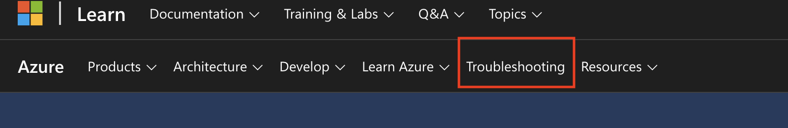

# Exam Notes

## Notes
1. Container Must be re-created if:

    a. Change partition key

    b. Change conflict resolution policy

    c. Change unique index

    d. Change vector search

    e. Change disk encryption

## Useful keywords in Microsoft Learn

1. [Monitoring Data](https://learn.microsoft.com/en-us/azure/cosmos-db/monitor-reference?context=%2Fazure%2Fcosmos-db%2Fcontext%2Fcontext)

2. [HTTP Status Code](https://learn.microsoft.com/en-us/rest/api/cosmos-db/http-status-codes-for-cosmosdb)

3. Always be prepared to navigate to CosmosDB overview in Azure Portal. Most of the information you need is there. To navigate.

   a. Search for "CosmosDB" in the search bar.

   b. Click on "CosmosDB" in the search results.

   c. Click on "Overview" in the left-hand menu.

4. Find Troubleshooting in Azure Learn Menu. This is very useful as example of a question:

_Question_: What is the restrictions (max fields) Azure Synapse Link can integrate with CosmosDB.

_Answer_: You can have a maximum of 1,000 properties across all nested levels in the document schema and a maximum nesting depth of 127.

_Method_: Find in troubleshooting section for "Azure Synapse Analytics Serverless SQL Pool troubleshooting documentation".

## Timing
You have ONLY 2 hours to complete ~60 questions. With that you can only spend an average of 2 minutes per question, so time it properly and if the question seems simple enough just go thru it.

Return to review can risk more time than expected. To actually return to view all questions after review, click on a button on the top left to go back to view all questions. Unlike AWS, once you go to a review question you need to click on the button on the top left to go back to view all questions, else you need to keep clicking NEXT.

