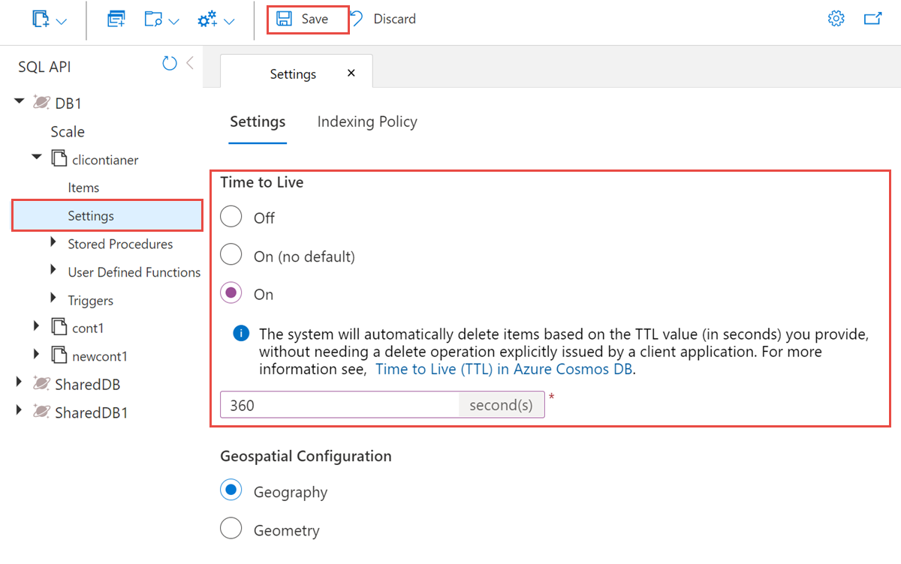

# TTL
Auto-expire documents after a specified time period. 

- Requires Indexing to be enabled (IndexingMode=consistent). Meaning if indexing policy set to NONE, no TTL.
- Also not possible to disable indexing to NONE if TTL is active.
- Item level always overrides regardless of container. Except if container TTL set to NULL.
- TTL is disabled if container level TTL is set to NULL.
- Based on _ts field (timestamp) except when using custom TTL path.
- TTL resets after every modification of record. I.e. if you update a record, the TTL is reset.

*NOTE*: For scenario to use TTL but no indexing, just set to consistent and put only exclude with \*


## TTL at Container level



Settings in seconds (via code)
| Value | Action |
| --- | --- |
| null | TTL is Off. Even individual will NOT expire. |
| 0 | Expire immediately |
| -1 | Set to ON, but never expires. Useful for custom TTL path |
| 1-2147483647 | Set ON and default to seconds, Max TTL is 68 years. |

## In Item level
An explicit TTL value on an item (e.g., 10 or -1) always takes precedence over the container's default setting, whether that default is infinite (-1), a positive number. (BUT NOT if null - globally disabled)

In item level you CANNOT set it to null to disable but you can set to -1.

```csharp
ContainerProperties properties = new ()
{
    Id = "container",
    PartitionKeyPath = "/customerId",
    // Expire all documents after 90 days
    DefaultTimeToLive = 90 * 60 * 60 * 24
};
```

```json
{
    "id": "1",
    "_rid": "Jic9ANWdO-EFAAAAAAAAAA==",
    "_self": "dbs/Jic9AA==/colls/Jic9ANWdO-E=/docs/Jic9ANWdO-EFAAAAAAAAAA==/",
    "_etag": "\"0d00b23f-0000-0000-0000-5c7712e80000\"",
    "_attachments": "attachments/",
    "ttl": 10, // Set ttl not _ttl
    "_ts": 1551307496
}
```

# No Custom TTL fields for NOSQL API

1. **Duration vs. Absolute Time**: The standard `ttl` property must be a **positive integer representing seconds**. Cosmos DB calculates expiration as `_ts + ttl`.
2. **Naming and Location**: The property must be named exactly `ttl` (lowercase) and must be at the **root level** of the JSON document. Nested paths are not supported for the built-in TTL mechanism in the SQL API.
3. **Absolute Expiration Workaround**: If you need to expire a document at a specific absolute time, your application must calculate the remaining duration (Target Time - Current Time) and store that value in the `ttl` field.
4. **Container Setting**: To enable item-level TTL, the container's `DefaultTimeToLive` must be set to either `-1` (On, no default) or a positive integer (On, with default).
5. If using DocumentDB/MongoDB API, you can use custom TTL fields. But custom TTL fields are based on epoch time (Unix timestamp) and NOT seconds. 


