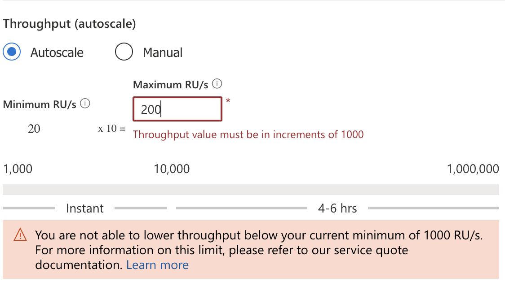

# CLI Commands

| Command | Description |
| --- | --- |
| az cosmosdb | This group contains the commands required to create and manage a new Azure Cosmos DB account. |
| az cosmosdb sql | This subgroup of the az cosmosdb group contains the commands to manage NoSQL API-specific resources such as databases and containers. |

```bash
az cosmosdb create
--name ''
--resource-group ''
--default-consistency-level 'Eventual'
--enable-free-tier 'true'

az cosmosdb sql database create
--account-name ''
--resource-group ''
--name ''
```

## Updating container index with --idx

@ can be used as read from file

```bash
az cosmosdb sql container create \
   ...
    --idx '@.\policy.json' 
```

OR

```bash
az cosmosdb sql container create \
   ...
   --idx '{"indexingMode": "consistent", "automatic": "true"}'
```

# Throughput

NOT sure how true without migrate keyword. But consider on the command `az cosmosdb sql database create` there are no parameters to specify the throughput-type.

If you are in... | And you use parameter... | Result
-- | -- | --
Autoscale | --max-throughput | Keeps Autoscale; changes the ceiling.
Autoscale | --throughput | Converts to Manual at that fixed RU/s.
Manual | --throughput | Keeps Manual; changes the fixed RU/s.
Manual | --max-throughput | Converts to Autoscale with that ceiling.


## Manual

(See difference between **database** and **container** command)
```bash
az cosmosdb sql database throughput update \
    --account-name '<account-name>' \
    --resource-group '<resource-group>' \
    --name '<database-name>' \
    --throughput '4000'
```

OR

```bash
az cosmosdb sql _container_ create \
   ...
    --throughput '4000'
```

## Autoscale

```bash
az cosmosdb sql container throughput update 
  ...
  --max-throughput '4000'
```

## Migrate for switching

You cannot change throughput-type without **MIGRATE** keyword.

```bash
az cosmosdb sql container throughput migrate \
    --account-name '<account-name>' \
    --resource-group '<resource-group>' \
    --database-name '<database-name>' \
    --name '<container-name>' \
    --throughput-type 'autoscale'
```

```bash
az cosmosdb sql container throughput update \
    ...
    --max-throughput '5000'
```

# CosmosDB Account Update
To change settings at account level use `az cosmosdb update`:

## Failover
https://learn.microsoft.com/en-us/training/modules/write-scripts-for-azure-cosmos-db-sql-api/6-change-region-failover-priority
1. failover
2. add/update/delete region (all the same ... if not included it's remove)

```bash
az cosmosdb failover-priority-change
--name ''
--resource-group ''
--failover-policies 'westus2=0' 'eastus=1'
```

If use this will cause a failover immediately. I.e.
- Will always failover/activate to region with 0. If put this and before the region is eastus, then really will take effect and failover to westus2.
- Any priority change to a region that is != 0 will not trigger a failover. Ie. if update eastus to asiapacific --failover-policies 'westus2=0' 'eastus=1', nothing happens (unless westus2 fails).
- Must always have 0 priority.
- Not necessary be +1 step. Can be 'westus2=4 eastus=0'.

## Notes

1. If use container command, and re-run it, it actually Update and not Re-create. e.g. az cosmosdb sql container.... and add new parameter it just updates it.
2. Switching throughput-type between autoscale/manual must use MIGRATE, regardless of container or database.
3. `max-throughput` is ONLY for autoscale. At least 1000 (100 x 10) and must always be by 1000. Minimum is always by 10 times.

