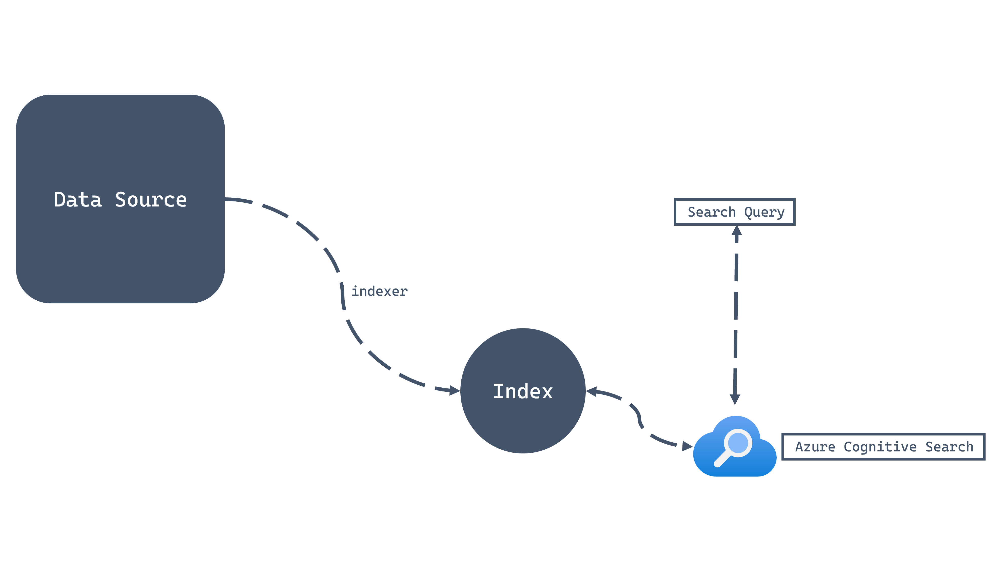

# Cognitive Search
Also known as a search method that uses machine learning to understand the meaning of a search query and return results that are most relevant to the query. Here we focuses on using Open AI as the tool.
Highlight is that there is a scheduled "indexer" that runs query. This is "Azure AI Search" example.
https://microsoftlearning.github.io/dp-420-cosmos-db-dev/instructions/15-cognitive-search.html


# Index
Indexing mode has to be set, meaning as consistent and not NONE.

Each field (of index) can optionally have feature of :

| Feature | Description |
| -- | -- |
| Retrievable | Configures the field to be projected in search result sets, else hidden |
| Filterable | Accepts OData-style filtering on the field |
| Sortable | Enables sorting using the field |
| Facetable | Allows field to be dynamically aggregated and grouped |
| Searchable | Allows search queries to match terms in the field, else the field is exact match |


Filterable means exact match (like > =). Searchable are more like elastic match/like.

```json
{
    "messages": [
        {
            "role": "user",
            "content": "What are the safety features of the X-500 model?"
        }
    ],
    "data_sources": [
        {
            "type": "azure_search",
            "parameters": {
                "endpoint": "https://your-search-service.search.windows.net",
                "index_name": "manuals-index",
                "search_fields": ["Title", "SafetyInstructions"], // Targets only these searchable fields
                "query_type": "simple" // or "semantic" / "vector"
            }
        }
    ]
}
```

```json
{
    "messages": [
        {
            "role": "user",
            "content": "What are the best lightweight laptops for travel?"
        }
    ],
    "data_sources": [
        {
            "type": "azure_search",
            "parameters": {
                "endpoint": "https://your-search-service.search.windows.net",
                "index_name": "products-index",
                "filter": "price lt 1000 and category eq 'Electronics'" 
            }
        }
    ]
}
```

## Indexer
Indexer is meant to be a scheduler to index with Index. Index is the fields to index.

Either using Portal or Rest API to configure indexer
https://learn.microsoft.com/en-us/azure/search/search-how-to-index-cosmosdb-sql?tabs=portal-check-indexer#define-the-data-source

focus on:
- dataChangeDetectionPolicy
- dataDeletionDetectionPolicy

```http
POST https://[service name].search.windows.net/datasources?api-version=2025-09-01
Content-Type: application/json
api-key: [Search service admin key]
{
    "name": "[my-cosmosdb-ds]",
    "type": "cosmosdb",
    "credentials": {
      "connectionString": "AccountEndpoint=https://[cosmos-account-name].documents.azure.com;AccountKey=[cosmos-account-key];Database=[cosmos-database-name]"
    },
    "container": {
      "name": "[my-cosmos-db-collection]",
      "query": null
    },
    "dataChangeDetectionPolicy": {
      "@odata.type": "#Microsoft.Azure.Search.HighWaterMarkChangeDetectionPolicy",
    "  highWaterMarkColumnName": "_ts"
    },
    "dataDeletionDetectionPolicy": null,
    "encryptionKey": null,
    "identity": null
}
```

## Delete

* Need to set _isDeleted(default) to true, to soft delete the index from cognitive search.

Cognitive Search does not ensure deletion of the index. Use the soft-delete policy, the **softDeleteColumnName** for the data source (Azure Cosmos DB for NoSQL) would be configured as **_isDeleted**. The **softDeleteMarkerValue** would then be set to true. Using this strategy, Azure Cognitive Search will remove items that have been soft-deleted from the container.

If using TTL There are 3 method

1. Implement soft-delete (add column) and set deletion before TTL takes effect.
2. Implement with change feed to send DELETE via API
3. Full re-index


The most reliable way to handle deletions (including implicit TTL deletions) with the Azure AI Search Cosmos DB indexer is to use a Soft Delete Policy.

1. Implement a Soft Delete Field in Cosmos DB
Add a boolean field (e.g., isDeleted) to your Cosmos DB documents.

When a client application needs to "delete" a record, it doesn't perform a physical DELETE operation, but instead performs an UPDATE to set the isDeleted flag to true. This update modifies the document's _ts property, which the indexer detects as a change.

2. Configure the Cosmos DB TTL
Configure your Cosmos DB TTL setting to delete the item after a period of time, for example, one week or 30 days. This period should be long enough to ensure the Azure AI Search indexer runs and processes the "soft deletion" update before the item is physically removed by TTL.

3. Configure the Azure AI Search Indexer
You need to configure the indexer's Data Deletion Detection Policy:

Set the policy type to Soft Delete Column Tracking.

Specify the softDeleteColumnName as your soft delete field (e.g., isDeleted).

Specify the softDeleteMarkerValue as the value that indicates the document should be deleted from the search index (i.e., true).


# Index updates based on _ts

Updates to cognitive search use field detection. 

Use _ts field (for non-sql) as this have a date that can monitor for progressive index change. Need to declare custom sql

If you write a custom query, you must sort using the same field to enable incremental progress when indexing.

```sql
 SELECT 
     p.id, 
     p.category, 
     p.name, 
     p.price,
     p._ts
 FROM 
     products p 
 WHERE 
     p._ts > @HighWaterMark 
 ORDER BY 
     p._ts
```

## Detect changes

Only with Azure AI Search there is a parameter @HighWaterMark, this is a reserved word and it is a timestamp to indicate any items have changed.

> Azure AI Search (formerly Azure Cognitive Search): The search service uses the _ts (timestamp) property of Cosmos DB documents to perform incremental indexing. The @HighWaterMark is a system parameter passed to the query that the search indexer runs. This parameter tells the indexer to only retrieve documents where the _ts value is greater than or equal to the last time the index was updated, allowing for efficient change tracking.

```sql
SELECT
    *
FROM
    c
WHERE
    c.TARGET >= @HighWaterMark
ORDER BY
    c.TARGET
```

# Search

There is a search called facet (nice to know), where it aggregates the result.
```json
 {
     "search": "road"
     , "count": true
     , "top": 15
     , "facets": ["price,interval:500"]
 }
```

Result:
```json
{
  "@odata.context": "https://dp-420-ai-search.search.windows.net/indexes('products-index')/$metadata#docs(*)",
  "@odata.count": 575,
  "@search.facets": {
    "price": [
      {
        "value": 0,
        "count": 191
      },
      {
        "value": 500,
        "count": 156
      },
      {
        "value": 1000,
        "count": 126
      },
      {
        "value": 1500,
        "count": 24
      },
      {
        "value": 2000,
        "count": 48
      },
      {
        "value": 3500,
        "count": 30
      }
    ]
  },
  "value": [
 //...top 15 record result
  ]
}
```

# Cosmosdb Index on _ts

The Dependency: In Cosmos DB, the _ts field is only automatically indexed when the mode is set to Consistent. If indexing is disabled, the search indexer may fail to track changes efficiently, leading to missed updates in your search results.

Avoid "None": If you set indexing to None, you cannot run SQL queries against your Cosmos DB data, and the indexer (which uses a query to pull data) will not be able to "see" your records to pull them into the search service.

*Cosmos DB only updates and tracks the _ts efficiently if the Indexing Mode is set to Consistent. If you turn indexing off entirely, the indexer won't be able to easily find new or updated records. In otherwords, includedPaths/composite doesn't really matter.

# Sequence to integrate

1. Create an AI Search in Portal
2. Configure connection to CosmosDB
3. Define a Query with ORDER BY (important to specify @highwatermark)
4. Add search field Index.
5. Create and define Indexer.

## Index
```
POST https://[service name].search.windows.net/indexes?api-version=2025-09-01
Content-Type: application/json
api-key: [Search service admin key]
{
    "name": "mysearchindex",
    "fields": [{
        "name": "rid",
        "type": "Edm.String",
        "key": true,
        "searchable": false
    }, 
    {
        "name": "description",
        "type": "Edm.String",
        "filterable": false,
        "searchable": true,
        "sortable": false,
        "facetable": false,
        "suggestions": true
    }
  ]
}
```

## Indexer
```
POST https://[service name].search.windows.net/indexers?api-version=2025-09-01
Content-Type: application/json
api-key: [search service admin key]
{
    "name" : "[my-cosmosdb-indexer]",
    "dataSourceName" : "[my-cosmosdb-ds]",
    "targetIndexName" : "[my-search-index]",
    "disabled": null,
    "schedule": null,
    "parameters": {
        "batchSize": null,
        "maxFailedItems": 0,
        "maxFailedItemsPerBatch": 0,
        "base64EncodeKeys": false,
        "configuration": {}
        },
    "fieldMappings": [
  {
    "sourceFieldName": "_city",
    "targetFieldName": "city",
    "mappingFunction": null
  }
    ],
    "encryptionKey": null
}
```