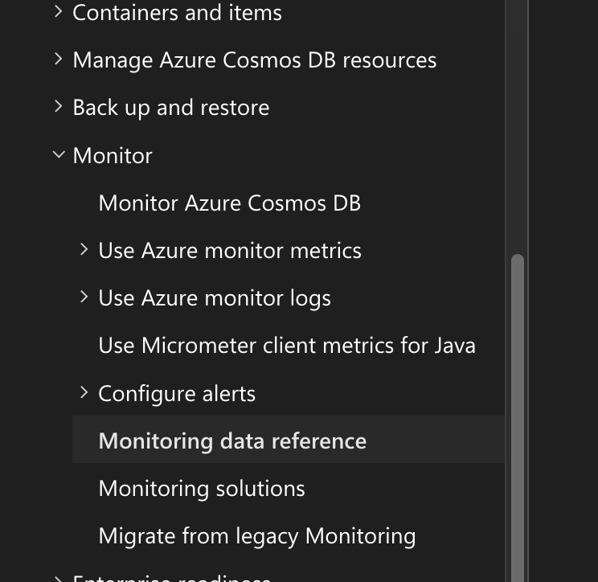
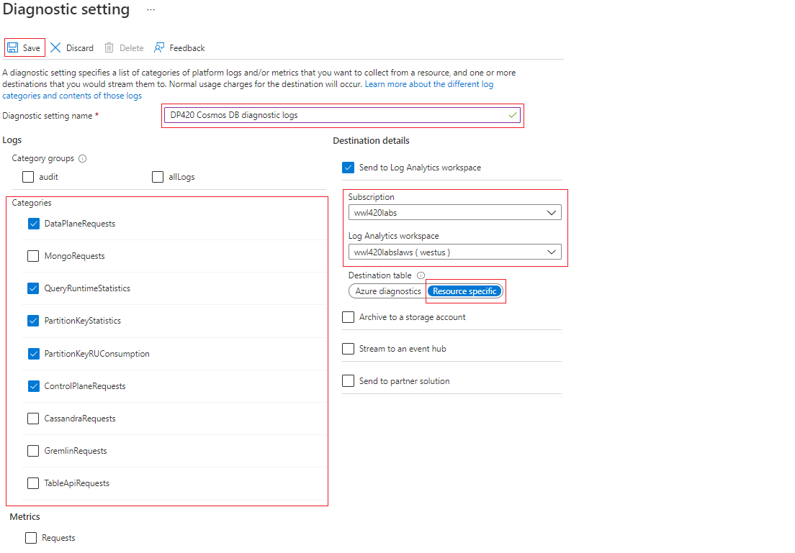

# Monitoring

For Exam be familiar at "Monitoring Data Reference"


## Diagnostic Categories

| Category | Description |
| --- | --- |
DataPlaneRequests | This table logs back-end requests for operations that execute create, update, delete, or retrieve data.
QueryRuntimeStatistics | This table logs query operations against the NoSQL API account.
PartitionKeyStatistics | This table logs logical partition key statistics in estimated KB. It's helpful when troubleshooting skew storage.
PartitionKeyRUConsumption | This table logs every second aggregated RU/s consumption of partition keys. It's helpful when troubleshooting hot partitions.
ControlPlaneRequests | This table logs Azure Cosmos DB account control data, for example adding or removing regions in the replication settings. 



New Azure diagnostic use CDB* keyword
```kusto
CDBDataPlaneRequests
| where TimeGenerated >= ago(1h)
| summarize OperationCount = count(), TotalRequestCharged=sum(todouble(RequestCharge)) by OperationName
| order by TotalRequestCharged desc 
```

Others monitor use Diagnostic
```kusto
AzureDiagnostics 
| where TimeGenerated >= ago(1h)
| where ResourceProvider=="MICROSOFT.DOCUMENTDB" and Category=="DataPlaneRequests" 
| summarize OperationCount = count(), TotalRequestCharged=sum(todouble(requestCharge_s)) by OperationName
| order by TotalRequestCharged desc 
```

## Alert

To alert based on collection name, use "split by dimension".
The others are:
**Aggregation Type:** Average (You want to alert on sustained load, not a momentary spike).
**Unit**: Percent (The CPU metric is a percentage).
**Threshold**: 90 (If the aggregated value is compared against 90).
**Operator**: Greater than (>).

## Example troubleshooting Request Rate Too Large
Be familiar in troubleshooting via Kusto query
https://learn.microsoft.com/en-us/azure/cosmos-db/nosql/troubleshoot-request-rate-too-large?tabs=resource-specific#rate-limiting-on-metadata-requests

```kusto
CDBPartitionKeyRUConsumption
 | where TimeGenerated >= ago(24hour)
 | where CollectionName == "CollectionName"
 | where isnotempty(PartitionKey)
 // Sum total request units consumed by logical partition key for each second
 | summarize sum(RequestCharge) by PartitionKey, OperationName, bin(TimeGenerated, 1s)
 | order by sum_RequestCharge desc
```

## PopulateIndexMetrics

Azure Cosmos DB provides indexing metrics to show both utilized indexed paths and recommended indexed paths. We only recommend enabling the index metrics for troubleshooting query performance.

Header is "x-ms-cosmos-query-metrics", and need to set "populate_query_metrics"

https://learn.microsoft.com/en-us/azure/cosmos-db/nosql/index-metrics?tabs=dotnet

```
Index Utilization Information
  Utilized Single Indexes
    Index Spec: /Item/?
    Index Impact Score: High
    ---
    Index Spec: /Price/?
    Index Impact Score: High
    ---
  Potential Single Indexes
  Utilized Composite Indexes
  Potential Composite Indexes
    Index Spec: /Item ASC, /Price ASC
    Index Impact Score: High
    ---
```

## Metadata request.

Metadata operations, such as creating a container or reading database properties (which are part of the control plane), consume a system-reserved throughput limit from a primary partition that holds all the account metadata.

This is a control plane to monitor creation/deletion/meta query of container or database.

If question are to target the database, ONLY metadata request is the right answer and not total request units.

## Full text query

This is log diagnostic not cosmos db feature!

Enabling this avoid truncated and obscured (hidden) data.

Good for query analysis but cost $ as data store is very big.

# Moving resource for Diagnostic Data

If you need to delete, rename, or move a resource, or migrate it across resource groups or subscriptions, first delete its diagnostic settings. Otherwise, if you recreate this resource, the diagnostic settings for the deleted resource could be included with the new resource, depending on the resource configuration for each resource. If the diagnostics settings are included with the new resource, this resumes the collection of resource logs as defined in the diagnostic setting and sends the applicable metric and log data to the previously configured destination.

Also, it's a good practice to delete the diagnostic settings for a resource you're going to delete and don't plan on using again to keep your environment clean.

# Notes
1. Do not enable diagnostic and analytics to write together into the same analytic workspace . Else will get duplicate data.