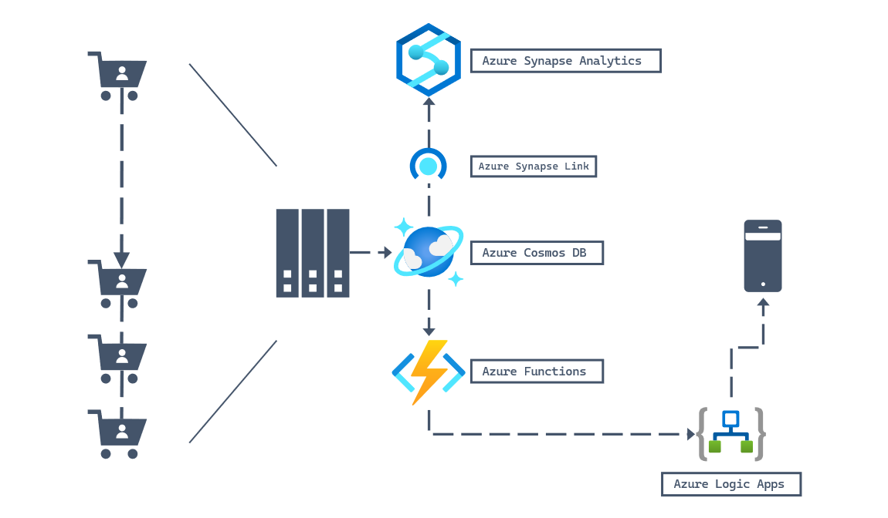

# Azure Analytics Connectivity

This section might need more improvements as I do not have full hands-on experience with it.

Also learn that it is deprecated(as of 2026) and to move forward using Azure Fabric, but may still appear in exam. https://learn.microsoft.com/en-us/azure/cosmos-db/configure-synapse-link?context=%2Fazure%2Fcosmos-db%2Fcontext%2Fcontext

## Synapse Link

1. Azure Synapse Link is a feature that allows you to connect your Azure Synapse Analytics workspace to your Azure Cosmos DB account. This feature enables you to perform analytics on your data stored in Azure Cosmos DB using the SQL API.

**Sink** - is destination to store data, in this case when enabled when cosmosdb is written it will write to a "DEDICATED" analytical store. This is not a duplicate Cosmos DB database; it is a dedicated, internally managed cloud storage optimized for massive analytical queries.

To enable Azure Analytics you need to enable: _(Take note in practise exam it seems the answer is wrong to select db instead of account)_
- Account level for --enable-analytic-storage
- Create container with --analytical-storage-ttl (set more than 0)

Template, keyword **enable-analytical-storage** and **--analytical-storage-ttl** (time to live)
`
az cosmosdb create --name <name> --resource-group <resource-group> --enable-analytical-storage true
az cosmosdb sql container create --resource-group <resource-group> --account <account> --database <database> --name <name> --partition-key-path <partition-key-path> --throughput <throughput> --analytical-storage-ttl -1

// note: you can even enable after a container is created.
az cosmosdb sql container **update** \
  --resource-group <resource-group> \
  --account-name <account> \
  --database-name <database> \
  --name <name> \
  --analytical-storage-ttl 60

New-AzCosmosDBAccount -ResourceGroupName <resource-group> -Name <name>  -Location <location> -EnableAnalyticalStorage true
New-AzCosmosDBSqlContainer -ResourceGroupName <resource-group> -AccountName <account> -DatabaseName <database> -Name <name> -PartitionKeyPath <partition-key-path> -Throughput <throughput> -AnalyticalStorageTtl -1
`

Step | Scope | Action/Setting | Effect on Data Flow
-- | -- | -- | --
Prerequisite | Database (account1) | Enable Azure Synapse Link. | No data sync. Simply unlocks the feature for future containers.
Activation | Container (container1) | Set Analytical Store TTL to -1 or $n$ seconds or null. | Data sync starts immediately.
Link | Azure Synapse | After enable need to connect it either via link service or endpoint authentication

## Columnar storage 
A data storage method that organizes data by columns instead of rows. It's a key architectural feature of databases and file formats designed for analytics and data warehousing because it significantly improves the performance of read-heavy workloads.

### How It Works
In a traditional row-oriented database, all data for a single record is stored together. For example, in a customer table, the name, address, and phone number for one person would be stored contiguously on disk.

In a column-oriented database, all data for a single column is stored together. For the same customer table, all the names would be stored together, all the addresses together, and all the phone numbers together.

## Analytical time-to-live (ATTL)

When analytical TTL is set to a value larger than transactional TTL value, your container will have data that only exists in analytical store. This data is read only and currently we don't support document level TTL in analytical store. If your container data may need an update or a delete at some point in time in the future, don't use analytical TTL bigger than transactional TTL. This capability is recommended for data that won't need updates or deletes in the future.

- Analytical TTL (ATTL) indicates how long data should be retained in your analytical store, for a container.
- Analytical store is enabled when ATTL is set with a value other than null. When enabled, inserts, updates, deletes to operational data are automatically synced from transactional store to analytical store, irrespective of the transactional TTL (TTTL) configuration. 
- If the value is set to -1: the analytical store retains all historical data, irrespective of the retention of the data in the transactional store. This setting indicates that the analytical store has infinite retention of your operational data.
- While TTTL can be set at the container or item level, ATTL can only be set at the container level currently.

## Azure Stream Analytics

To be clear ASA is not Analytic Store. You can have Azure Stream Analytics without Analytic Store enabled. This is a service that source from (EventHub, or Azure IOT) then sink it to CosmosDB.

Azure Stream Analytics only supports connection to Azure Cosmos DB by using the SQL API. Other Azure Cosmos DB APIs are not yet supported. If you point Azure Stream Analytics to the Azure Cosmos DB accounts created with other APIs, the data might not be properly stored.

The sink is CosmosDB Mongo DB.

https://learn.microsoft.com/en-sg/training/paths/work-with-hybrid-transactional-analytical-processing-solutions/

## Data Mapping
This is a parameter that defines how Azure Cosmos DB maps data from the transactional store to the analytical store.

There are 2 types of --analytical-storage-schema-type
- **Well-defined**: Best for data with a consistent, flat schema. It maps types specifically for optimized query performance. The default schema type for an Azure Cosmos DB for NoSQL account.
- **Full fidelity**: Captures the full schema, including nested documents, and handles schema evolution by unioning all historical schemas. It is best for data with varying structures. The default (and only supported) schema type for an Azure Cosmos DB for MongoDB account.

## Azure Synapse Link Best Practices:

- Operational store: Use for OLTP workloads with fast, transactional processing.
- Analytical store: Use for OLAP workloads that require high-performance queries on large datasets.

## TTL Settings: Manage retention periods for cost optimization and data lifecycle management.

Common Use Cases for Managing TTL:
- Long-term Storage: Use TTL = -1 to retain historical data for compliance or trends analysis.
- Temporary Analysis: Use TTL = 0 to delete temporary analytical data when testing configurations.
- Hybrid Workloads: Combine TTL policies with scaling strategies like autoscale for dynamic workloads.

** Null: Setting the TTL value of the operational store of container1 to null will prevent the automatic expiration of items in the container, at which point, the item-level TTL values will take effect. NOTE This is not a valid value, but in some paper/document it notes this can be set...contradicting, i believe it should be -1.

## The Effect of Setting Analytical TTL to 0

It **disables and deletes Synapse link** and are not recoverable. **Analytical store support cannot be disabled without deleting the container**. Setting the analytical store TTL value to 0 effectively disables the analytical store by no longer syncing new items to it from the operational store and deleting already synced items from the analytical store.

**Stops Future Syncing**: Setting the ATTL to 0 immediately stops the automated, near real-time replication of new data from the operational store (container1) to the analytical store. No new or updated records will be synchronized.

**Deletes All Existing Analytical Data**: Setting the ATTL to 0 is a documented way to disable the analytical store on the container, which triggers the permanent deletion of all existing synced data from the analytical store. This data is no longer available to workspace1 via Synapse Link.

**Irreversible Action (The Critical Caveat)**: Unlike setting ATTL to a positive integer (which can be changed later), setting it to 0 is a destructive action for the analytical configuration.

In the Azure Portal/CLI/SDKs: Once you set ATTL to 0 and save the container properties, you cannot simply change it back to -1 (infinite retention) or another positive value. You have functionally disabled the Synapse Link feature on that specific container.

**To Re-Enable**: To start using Synapse Link and the analytical store on container1 again, you would typically need to contact Azure Support.