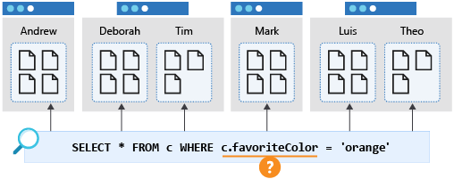

# Queries

1. Query does not matter as single(') or double(") quotes.
2. Query supports only single container, hence using alias, container name or both together does not make any diff.

```sql
SELECT * FROM category where category.id='0120'
SELECT * FROM category c where c.id="0120"
SELECT * FROM eee where eee.id='0120'
```
## Functions
Mostly can be found in MS Learn site, interesting functions are:
  - CONCAT
  - LOWER
  - IS_DEFINED
  - IS_ARRAY
  - IS_NUMBER
  - SELECT DISTINCT VALUE
    p.categoryName
FROM
    products p
- SCALAR
     SELECT
      ("Redmond" = "WA") AS isCitySameAsState,

VALUE is to flatten. E.g.
``` sql
SELECT c.name FROM c WHERE c.categoryId = 'Books'	//[ { "name": "Dinosaur" }, { "name": "Monster" } ]
SELECT VALUE c.name FROM c WHERE c.categoryId='Books' //["Dinosaur","Monster"]
```

``` sql
SELECT VALUE c.name FROM c WHERE c.categoryId = 'Books'	//[ "Dinosaur", "Monster" ]
SELECT VALUE {name: c.name} FROM c // [ {name: "Dinosaur"}]
SELECT { 'price': p.price} AS scannerData FROM p // {scannerData: {"price": 2.10}}
SELECT { 'price': p.price} FROM p // { $1: {price: 100} }

```
https://learn.microsoft.com/en-sg/azure/cosmos-db/nosql/query/select


IN for array

```sql
SELECT c.user FROM c WHERE EXISTS (
   SELECT n FROM n IN c.items WHERE n.sku = 2
) //{items: [{sku:1}, {sku:2}]**
```

Specific array

```sql
SELECT VALUE c.categories[0] FROM ProductsContainer c
```

## Cross partition Query

The '**enableCrossPartitionQuery**' option in Azure Cosmos DB is a flag that explicitly allows a query to be executed across all physical partitions of a container.

In a partitioned Cosmos DB container, data is divided into smaller subsets based on the partition key you defined.

### How it Works
Default Behavior (Single-Partition Query): If your query contains a filter on the partition key (e.g., SELECT * FROM c WHERE c.userId = '123'), the SDK knows exactly which partition to route the query to. This is the most efficient type of query and doesn't require the enableCrossPartitionQuery flag.

Cross-Partition Query: If your query does not include a filter on the partition key (e.g., SELECT * FROM c WHERE c.city = 'Seattle'), the Azure Cosmos DB SDK must check every physical partition to find matching documents.

- In earlier versions of the SDKs, attempting such a query without explicitly setting 'enableCrossPartitionQuery': true would result in an error, as a safety mechanism to prevent accidentally executing an expensive query.
- Setting the flag to true explicitly tells the client and the service, "I know this query will scan all partitions, and I permit it."

Very hard to test, only happens if:
Imagine you add millions of new items with thousands of unique categoryId values. Your container's storage will exceed 50 GB, or your provisioned throughput will exceed 10,000 RU/s.

Cosmos DB will automatically split the data and create multiple physical partitions (e.g., 5 partitions) to scale out the container.

Query: SELECT * FROM p WHERE p.price > 2
Physical Partitions: 5 (Large Data Volume)
Result with enableCrossPartitionQuery: false: Error (or no results in older SDKs).

Reason: The query does not contain the partition key filter (categoryId). The SDK cannot determine which of the 5 partitions to use, and since you have explicitly forbidden a cross-partition fan-out, the operation fails.

A query that filters on a different property, such as favoriteColor, would "fan out" to all partitions in the container. This is also known as a cross-partition query. Such a query will perform as expected when the container is small and occupies only a single partition. However, as the container grows and there are increasing number of physical partitions, this query will become slower and more expensive because it will need to check every partition to get the results whether the physical partition contains data related to the query or not.

Diagram that shows a cross-partition query for favorite color.



### Notes for cross partition:

1. Cross partition do not happen on only 1 match to partition. E.g. SELECT * from n where n.age=10 AND n.orderId=10; this case partition is orderId hence no cross partition. (see that it's AND and =)
2. Even with the keyfield id, it is best to provide partitionKey. Else it will cause cross-partition/fanout.

## Pagination

Behind the scene it's using continuation token
- Cannot use GROUP BY, where it cannot work.
- Works with SELECT DISTINCT, when used with ORDER BY.
- Records/results need to be iterated (this is pagination)

```javascript
const options = {
    maxItemCount: 100 // Set the maximum number of items per page
};

const iterator = container.items.query(query, options);

for await (const page of iterator.getAsyncIterator()) {
    page.resources.forEach(product => {
        console.log(`[${product.id}] ${product.name} $${product.price.toFixed(2)}`);
    });
}
```

```javascript
  const query = "SELECT * FROM products p";

  const iterator = container.items.query(
    query
  );

  while (iterator.hasMoreResults()) {
    const { resources } = await iterator.fetchNext();
    for (const item of resources) {
      console.log(`[${item.id}]	${item.name.padEnd(35)}	${item.price}`);
    }
```


```javascript
await getDistinctName(undefined) //first call should not pass continuation token.

async function getDistinctNames(existingToken) {
  const client = new CosmosClient("YOUR_CONNECTION_STRING");
  const container = client.database("YourDB").container("YourContainer");

  const querySpec = {
    query: "SELECT DISTINCT c.name FROM c"
  };

  // Define the options, passing the token if we have one
  const options = {
    maxItemCount: 10, // Limit results per page
    continuationToken: existingToken 
  };

  const queryIterator = container.items.query(querySpec, options);

  // Fetch only the next "page" of results
  const { resources: results, continuationToken: nextToken } = await queryIterator.fetchNext();

  console.log("Results:", results);
  
  if (nextToken) {
    console.log("More data available. Save this token for the next call:", nextToken);
  } else {
    console.log("No more results left.");
  }

  return { results, nextToken };
}
```

## Join for arrays

1. A JOIN in Azure Cosmos DB for NoSQL is different from a JOIN in a relational database as its only scope is a single item. A JOIN creates a cross-product between different sections of a **single item.**
2. It is as if to not-flatten (opposite of VALUE) a value.


```sql
SELECT 
    p.id,
    p.name,
    t.name AS tag
FROM 
    products p
JOIN
    t IN p.tags

/*
 {
   id: "0D3630F-B661-4FD6-A296-CD03BB7A4A0C",
   name: "Classic Vest, L",
   tags: [
     apparel,
     worn,
     no-damage
   ]
 }
*/
```

```json
[
    {
        "id": "80D3630F-B661-4FD6-A296-CD03BB7A4A0C",
        "name": "Classic Vest, L",
        "tag": "apparel"
    },
    {
        "id": "80D3630F-B661-4FD6-A296-CD03BB7A4A0C",
        "name": "Classic Vest, L",
        "tag": "worn"
    },
    {
        "id": "80D3630F-B661-4FD6-A296-CD03BB7A4A0C",
        "name": "Classic Vest, L",
        "tag": "no-damaged"
    }
]
```

```sql
// SELECT VALUE t FROM p JOIN t IN p.tags WHERE t='no-damage'

SELECT 
    p.id,
    p.name,
    t.name AS tag
FROM 
    products p
JOIN
    (SELECT VALUE t FROM t IN p.tags WHERE t.tag = 'no-damage') AS t

```

```json
[
    {
        "id": "80D3630F-B661-4FD6-A296-CD03BB7A4A0C",
        "name": "Classic Vest, L",
        "tag": "no-damaged"
    }
]
```

## Alternative

```
SELECT 
    p.id,
    p.name
FROM 
    products p
WHERE EXISTS (
    SELECT VALUE t 
    FROM t IN p.tags 
    WHERE t.class != 'trade-in'
)
```

## Using ARRAY

- this result only returns 1 record
- It is highly efficient as subquery compared with JOIN. As of 2026 this is the preferred way.

```
SELECT 
    p.id,
    p.name,
    ARRAY(SELECT VALUE t.name FROM t IN p.tags WHERE t.class != 'trade-in') AS filteredTags
FROM 
    products p
```

### Nice to know
This query only returns class of trade-in but nothing of other tags
```
SELECT p.id, p.name, l
FROM p
JOIN l IN c.tags
WHERE l.class = 'trade-in'
```

## Parameters

To avoid SQL injection, use parameters. It is also more efficient.

```javascript
import { SqlQuerySpec } from "@azure/cosmos";

const querySpec: SqlQuerySpec = {
  query: "SELECT * FROM Families f WHERE f.lastName = @lastName",
  parameters: [
    { name: "@lastName", value: "Wakefield" }
  ]
};

// Example usage with a container
// let response = await container.items.query(querySpec).fetchAll();
```

Use query definition as of v3 (new way)
```c#
string sql = "SELECT p.name, t.name AS tag FROM products p JOIN t IN p.tags WHERE p.price >= @lower AND p.price <= @upper"
QueryDefinition query = new (sql)
    .WithParameter("@lower", 500)
    .WithParameter("@upper", 1000);
using FeedIterator<dynamic> feedIterator = container.GetItemQueryIterator<dynamic>(
    queryDefinition: query,
    requestOptions: new QueryRequestOptions { MaxItemCount = -1 }
);
```

with SQLQuerySpec (old way)
```c# 
var customerIds = new List<int> { 5, 6, 7, 8 };
var querySpec = new SqlQuerySpec
{
    QueryText = "select * from c where ARRAY_CONTAINS(@customerIds, c.customerId)",
    Parameters = new SqlParameterCollection
    {
        new SqlParameter { Name = "@customerIds", Value = customerIds }
    }
};

// Example usage
// IQueryable<T> queryable = client.CreateDocumentQuery<T>(collectionLink, querySpec);
```

## Troubleshooting queries
To check long running queries/high consuming RUs
1. DataPlaneRequest
2. QueryRuntimeStatistics
3. Enable full-text query diagnostics. 

```
CDBDataPlaneRequests
| where todouble(RequestCharge) &gt; 10.0
| project ActivityId, RequestCharge
| join kind= inner (
CDBQueryRuntimeStatistics
| project ActivityId, QueryText
) on $left.ActivityId == $right.ActivityId
| order by RequestCharge desc
| limit 100
```

Azure Cosmos DB provides advanced logging for detailed troubleshooting. By enabling full-text query, you're able to view the deobfuscated query for all requests within your Azure Cosmos DB account. You also give permission for Azure Cosmos DB to access and surface this data in your logs.


## Optimistic Direct Execution (ODE)

https://learn.microsoft.com/en-us/azure/cosmos-db/nosql/performance-tips-query-sdk?tabs=v3&pivots=programming-language-csharp

Take note on ODE (EnableOptimisticDirectExecution = true/false), setting true + partition key with maxconcurrency=1 will prevent fan-out meaning it only do a first match and return result.

**NOTE on ODE**:
When you enable EnableOptimisticDirectExecution (true) in the SDK, the client optimistically bypasses this initial query plan request for certain queries (typically single-partition, simple streaming queries).

Optimistic: The SDK assumes the query is simple and can be executed directly against a single partition.

Direct Execution: The query is sent directly to the backend physical partition without first consulting the Gateway for a full query plan.

Let's consider the query: <code style="font-family: &quot;Google Sans Text&quot;, sans-serif !important; line-height: 1.15 !important; margin-top: 0px !important;">SELECT * from r</code> (assuming 'r' is the alias for the document).

Feature | Normal Query Execution (ODE Disabled) | Query with EnableOptimisticDirectExecution = true
-- | -- | --
Execution Steps | 1. Query Plan Request: SDK asks Gateway for a plan. 2. Actual Query: SDK executes the query based on the plan. | 1. Optimistic Query: SDK sends the query directly to the backend. 2. Fallback (if needed): If the direct execution fails (e.g., it's actually cross-partition), it transparently falls back to getting a query plan and executing normally.

## Check Query performance 

Use `MaxItemCount=0`and `PopulateIndexMetrics` on query to estimate explain plan Returns cost estimate without consuming full RU for execution. This execution does incur small RU charges as it doesn't return results, only execute Plan on how to run (against ODE principal)

## Aggregation and UDF are much efficient

Aggregation is generally more efficient than UDFs. Given that if we have query like SELECT TOP 1 FROM c ORDER BY c.age, it's more efficient to run SELECT MIN(c.age) FROM c.

Reason:
1. ORDER is a full-scan on un-index field, but even on indexed field it need to sort.
2. Return first and stop with index using min.

## Point vs Query Read

- The difference is that point read if the document is 1kb, RU consumed is 1kb. While for Query if the query is 1kb it will consume est. 2.3RUs.
- It requires "id" + "partition key" for query.
- Command query
  1. ReadItemAsync - Requires both partition key & ID
  2. ReadManyItemsAsync - better than IN statement and pass as List
  3. ReadItemStreamAsync - Does not deserialize
  4. GetItemQueryIterator - No ID and Partition Key required
- NOTE: id is always unique, which is why it's point read.

Point read uses partitionkey during query(still considered query) and is consumes less RUs.
```c#
string categoryId = "26C74104-40BC-4541-8EF5-9892F7F03D72";
PartitionKey partitionKey = new (categoryId);

Product saddle = await container.ReadItemAsync<Product>(id, partitionKey);

List<(string, PartitionKey)> itemsToFind = new List<(string, PartitionKey)>
{
    ("P1", new PartitionKey("T1")),
    ("P2", new PartitionKey("T1")),
    ("P3", new PartitionKey("T2")) // Can even be from different partitions!
};
FeedResponse<Product> response = await container.ReadManyItemsAsync<Product>(itemsToFind);
```

Query without partition key
```c#
string sql = "SELECT * FROM c WHERE c.status = 'pending'";
QueryDefinition queryDefinition = new QueryDefinition(sql);

// 2. Initialize the iterator 
// Notice we DO NOT set the PartitionKey in QueryRequestOptions
using FeedIterator<MyItem> feedIterator = container.GetItemQueryIterator<MyItem>(
    queryDefinition,
//partitionKey: new PartitionKey("xyxyx") #For efficency.
    requestOptions: new QueryRequestOptions 
    { 
        MaxItemCount = 100 // Optional: limit results per page
    }
);
```

## Headers for Query
These headers are returned for query response.

| Header Name | Description |
| --- | --- |
| x-ms-continuation | The actual string (the token) you need to send back. |
| x-ms-item-count | How many items were actually returned in this batch. |
| x-ms-request-charge | The RU cost for just this specific page of the query. |

## Compute Properties

https://learn.microsoft.com/en-us/cosmos-db/query/computed-properties?tabs=dotnet

It's similar to User defined function, with limitation of:
- Queries must specify a FROM clause that represents the root item reference. Examples of supported FROM clauses are: FROM c, FROM root c, and FROM MyContainer c.
- Queries must use a VALUE clause in the projection.
- Queries can't include a JOIN.
- Queries can't use nondeterministic Scalar expressions. Examples of nondeterministic scalar expressions are: GetCurrentDateTime, GetCurrentTimeStamp, GetCurrentTicks, and RAND.
- Queries can't use any of the following clauses: WHERE, GROUP BY, ORDER BY, TOP, DISTINCT, OFFSET LIMIT, EXISTS, ALL, LAST, FIRST, and NONE.
- Queries can't include a scalar subquery.
- Aggregate functions, spatial functions, nondeterministic functions, and user defined functions (UDFs) aren't supported.

Example, declare it
```json
{ 
  "name": "cp_20PercentDiscount", 
  "query": "SELECT VALUE (c.price * 0.2) FROM c" 
} 
```

```sql
SELECT 
    c.price - c.cp_20PercentDiscount as discountedPrice, 
    c.name 
FROM 
    c 
WHERE 
    c.cp_20PercentDiscount < 50.00
```

## Subqueries performance

https://learn.microsoft.com/en-us/cosmos-db/query/subquery#exists-expression

This will generate many objects and will consume many RUs, since the filtering is performed after combining the objects in the JOIN.
```sql
SELECT
    p.title,
    a.name AS author
FROM
    books b
JOIN
    a IN p.authors
WHERE
    a.name = "John Smith"
```

Instead, using EXISTS in a subquery will perform the filter before the JOIN, which will reduce the amount of data, reducing consumption.

```sql
SELECT
    b.name,
    EXISTS (SELECT VALUE
        a
    FROM
        a IN b. authors
    WHERE
        a.name = " John Smith ")
FROM
    books b
```