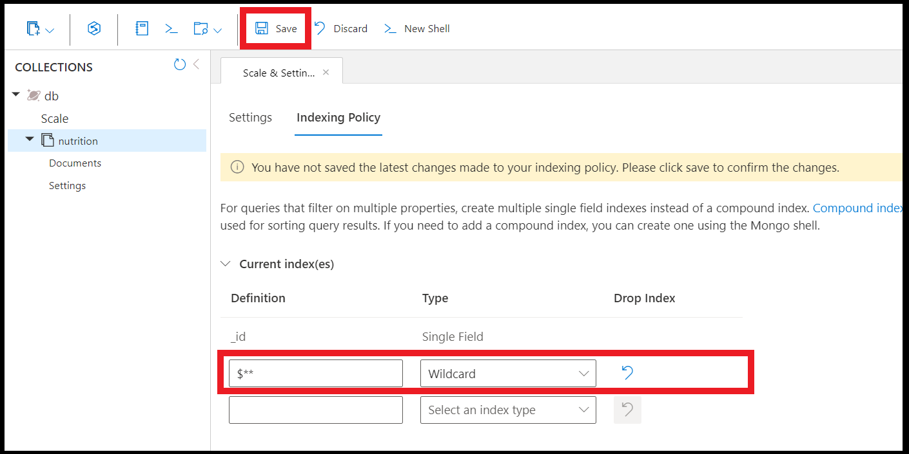

# Indexing

Some simple notes:
- Default includePaths is *, meaning all paths are indexed.
- Default only _etag is in excludePaths from index. If override e.g. excludePaths: "/name/?", then _etag will start to be included hence need to be explicitly stated.
- Default _ts is excluded and it's invisible. Hence even if you want to override you can't.

Just some sample how it search:
https://learn.microsoft.com/en-us/azure/cosmos-db/index-overview

## Indexing Paths

This is accessible under index tab of settings. All indexPath (except compositeIndex) **MUST** end either with wildcard or scalar(?) value else it is invalid.

Indexing is important as it changes the:
- speed
- and RU used

Three primary operators are used when defining a property path:
- The ? operator indicates that a path terminates with a string or number (scalar) value
- The [] operator indicates that this path includes an array and avoids having to specify an array index value
- The * operator is a wildcard and matches any element **beyond** the current path

| Path expression | Description |
| -- | -- |
| /* | All properties |
| /name/? | The scalar value of the name property. This does not include sub jsons or values after /name only fields. |
| /category/* | All properties under the category property, meaning /category/cat/price etc is included |
| /metadata/sku/? | The scalar value of the metadata.sku property |
| /tags/[]/name/? | Within the tags array, the scalar values of all possible name properties |


### Precedence

If both exclude and include clash, e.g. include is /food/ingredients/nutrition/* and exclude is /food/ingredients/* , then include takes precedence as it is better matched. /? is also higher than /* . Note: System have a check if both exclude and include has the same value.

## Indexing Mode
2 Types of indexing mode:
- None
Useful if write heavy and only relies on _id and partitionKey
- Consistent
 1. Consistent means will index while create/upsert/delete, while none doesn't. Good if there are no search or index needed on none, so opt for none first when executing a bulk.
 2. id and _ts is always indexed for NoSQL and this cannot be disabled (nor does it show in indexing)


Automatic
- true
- false
Documents are not indexed automatically. **HOWEVER** —and this is the key difference—the indexing engine is still "On."
Result: You can choose to index specific documents manually. In the NoSQL SDKs, you can send a special header (`x-ms-indexing-directive: include`) with a write request to index only that specific document.

Both are dependent

| Action | automatic: false | indexingMode: Consistent |
| -- | -- | -- |
| 1. User inserts a new document. | Index is NOT created for the document. | The Consistent mode's rule to update the index is never triggered because the document was blocked from being indexed by automatic: false. |
| 2. User immediately runs a query for the new document. | The query will likely miss the document or result in a high-RU scan, as it is not in the index. |  |


### Note
Mongo version is always Consistent.

# Composite index

Unlike indexPaths or excludePath, it **must not** end with /? or wildcard.

```sql
SELECT * FROM products p ORDER BY p.name ASC, p.price ASC
```

It is important the order is the same (price ASC, name ASC) will cause slower compared to (name ASC, price ASC)

```json
{
  "indexingMode": "consistent",
  "automatic": true,
  ...
  "compositeIndexes": [
    [
      {
        "path": "/name", //No scalar or wildcard
        "order": "ascending"
      },
      {
        "path": "/price",
        "order": "descending"
      }
    ]
  ]
```

## Composite Index Ordering and Search

1. Feature that have to be defined. But if only 1 field, defining either to composite index vs index path makes no difference(just fyi).
2. Order of ORDER BY is important. Meaning if index is "timestamp ASC then Name ASC", only this `SELECT * FROM c WHERE c.timestamp=123123 AND c.name ="John"  ORDER BY c.timestamp ASC, c.name ASC` will work, NOT `SELECT * FROM c WHERE c.name="John" AND c.timestamp=123123  ORDER BY c.name ASC, c.timestamp ASC
`
3. When query filter on multiple property, the equality filters MUST be the first property in composite index. What this means is, if the index is "timestamp ASC then Name ASC", this `SQL SELECT * FROM c WHERE c.timestamp > 123123123 AND c.name = "John" ORDER BY c.timestamp ASC, c.name ASC` or john= AND timestamp >, will NOT WORK. Only with c.timestamp = 123123123 will work. But if "name ASC, timestamp ASC" then `SQL SELECT * FROM c WHERE c.name="John" AND c.timestamp > 123 ORDER BY c.name ASC, c.timestamp ASC`, will WORK.  The logic is order of index corresponds to equality. 
4. ASC, DESC must match for ORDER BY. See mix order.
6. WHERE statement can exclude from filter, e.g. composite index is "name, age" the SQL `SELECT * from c where name="John" ORDER BY name ASC, age ASC` will work.
7. Composite Index should not have /? or /* and is CASE-SENSITIVE. Also remember that tuple/array is not supported with composite index.

```json
{
  "indexingMode": "Consistent",
  "compositeIndexes": [
    [{
      "path":"/name",
      "order": "ascending"
    },
   {
      "path":"/age",
      "order": "ascending"
    }],
    [...] //NOTE: It's array of array.
  ]
}
```

### Mixing composite index sort order

Cosmos DB's query engine can use a composite index in two ways:
- **Forward Scan**: Reading the index in the defined order.
- **Backward Scan**: Reading the index in the reverse of the defined order (e.g., an ASC index can serve a DESC query).
- if you want to support both ASC,ASC and ASC,DESC; then create 2 composite index which will create more write RU but less read RU.

| Index Definition | Query Supported (Forward Scan) | Query Supported (Backward Scan) | Your Query → (DESC, ASC) |
| -- | -- | -- | -- |
| A: (ASC, DESC) (Working) | (ASC, DESC) | (DESC, ASC) | Supported ✅ |
| B: (DESC, DESC) (Non-Working) | (DESC, DESC) | (ASC, ASC) | Not Supported ❌ |
| C: (ASC, ASC) | (ASC, ASC) | (DESC, DESC) | Not Supported ❌ |
| D: (DESC, ASC) | (DESC, ASC) | (ASC, DESC) | Supported ✅ |


### Mix order of > 2. E.g. age ASC, name DESC, gender ASC.

Supported is only, all other are not supported. I.e. **FULL INVERTED**
- age DESC, name ASC and gender DESC
- age ASC, name DESC and gender ASC

## Indexing for ORDER BY

An ORDER BY clause that orders by a single property always needs a range index and fails if the path it references doesn't have one. Similarly, an ORDER BY query that orders by multiple properties always needs a composite index.

If indexing of single field or composite index of multi-field is not properly defined, an error " The order by query does not have a corresponding composite index/index that it can be served from" is thrown.

| Description | Sample | Error |
| --- | --- | --- |
| Single field, requires at least index includedPath/compositeIndex | SELECT * FROM p ORDER BY p.category | "The index path corresponding to the specified order-by item is excluded." |
| > 1 field, requires a compositeIndex | SELECT * FROM p ORDER BY p.category, p.name | The order by query does not have a corresponding composite index that it can be served from. | 

Creating composite index

```json
{
  "indexingMode": "consistent",
  "automatic": true,
  "includedPaths": [
    {
      "path": "/*"
    }
  ],
  "excludedPaths": [
    {
      "path": "/\"_etag\"/?" # can use "/_etag/?" in most sdk.
    }
  ],
  "compositeIndexes": [
    [
      {
        "path": "/name",
        "order": "ascending"
      },
      {
        "path": "/price",
        "order": "descending"
      }
    ]
  ]
}
```

Note the escaped double quotes (/\"_etag\"/?). Because _etag is a system property with a leading underscore, the indexing engine requires the property name to be quoted in the path string to ensure it is parsed correctly.
It is also possible path: "_etag" in some codes, like data explorer.

## Scanning methods due to indexing/partition key/id

| Method | Description | RU implication |
| -- | -- | -- |
| Index seek | The query engine will seek an exact match on a field’s value by traversing directly to that value and looking up how many items match. Once the matched items are determined, the query engine will return the items as the query result. | The RU charge is constant for the lookup. The RU charge for loading and returning items is linear based on the number of items. |
| Index scan | The query engine will find all possible values for a field and then perform various comparisons only on the values. Once matches are found, the query engine will load and return the items as the query result. | The RU charge is still constant for the lookup, with a slight increase over the index seek based on the cardinality of the indexed properties. The RU charge for loading and returning items is still linear based on the number of items returned. |
| Full scan | The query engine will load the items, in their entirety, to the transactional store to evaluate the filters. | This type of scan does not use the index; however, the RU charge for loading items is based on the number of items in the entire container. |

An index scan can range in complexity from an efficient and precise index seek, to a more involved expanded index scan, and finally the most complex full index scan.

Full scans can potentially have significant request unit charges as the charge scales linearly with the total number of items in the container. While full scans are rare, it is essential to know that they are possible when using specific built-in functions in query filters.

## Debugging Index

To debug indexing required, the SDK can be added with *PopulateIndexMetrics* and retrieve with method **IndexMetrics**.

```c#
QueryRequestOptions options = new() {
  PopulateIndexMetrics = true
}
...
while(iterator.HasMoreResults)
{
    FeedResponse<Product> response = await iterator.ReadNextAsync();
    foreach(Product product in response)
    {
        // Do something with each product
    }

    Console.WriteLine(response.IndexMetrics);     /
}
```

It response with recommendation if there are:
```
Index Utilization Information
  Utilized Single Indexes
    Index Spec: /price/?
    Index Impact Score: High
    ---
    Index Spec: /name/?
    Index Impact Score: High
    ---
  Potential Single Indexes
  Utilized Composite Indexes
  Potential Composite Indexes
```

## Unique Key

**NOTE**: 
- Can only be created during container creation. YOU CANNOT change it.
- Unique key works by partition

For sharded collections, provide the shard (partition) key to create a unique index. All unique indexes on a sharded collection are **compound indexes**, and one of the fields is the shard key. The shard key should be the first field in the index definition.

After you create a container with a unique key policy, the creation of a new item or an update of an existing item that results in a duplicate within a logical partition is prevented, as specified by the unique key constraint. The partition key combined with the unique key guarantees the uniqueness of an item within the scope of the container.

https://learn.microsoft.com/en-us/azure/cosmos-db/unique-keys

E.g, given that the partition key is "category"
```json
[
{
    "name": "sample",
    "category": "demo"
},
{
    "name": "sample",
    "category": "demo"
}, //this fails
{
    "name": "sample",
    "category": "demo-2"
}, //passes
{
    "name": "sample-2",
    "category": "demo"
}
]


```

## Partition and Index

1. Index can suddenly grow during partition and will release after partition completed.
2. Partition key is always indexed (unless it's "/id")!! Don't need to explictly set, unless is a composite key.

## Full-text of Hybrid search

Feature has to be manually "enabled".

```json
{
  "indexingMode": "consistent",
  "fullTextIndexes": [
     {
        "path": "/name"
     }
  ]
}
```

## Difference

Feature | Full-Text Index | Normal (Range/Composite) Index
-- | -- | --
Primary Goal | Efficiently search for words or phrases within large text fields and rank results by relevance. | Efficiently filter data for exact matches, ranges, and sorting.
Search Functionality | Supports linguistic features like: tokenization (splitting text into words), stemming (searching for "run" finds "running"), stopword removal (ignoring "the," "a," etc.), and relevance scoring (e.g., using BM25). | Supports simple comparisons: =, >, <, BETWEEN, ORDER BY, LIKE 'prefix%'.
Index Structure | Typically an Inverted Index, where each unique word (lexeme) in the document maps to the list of documents and positions where that word occurs. | Typically a B-Tree or similar ordered structure, where the entire field value is indexed, allowing for fast ordered lookups.
Cosmos DB Use | Used with functions like FullTextContains, FullTextContainsAll, and for ranking results with ORDER BY RANK. (Available in the NoSQL API). | Used to optimize all standard SQL queries (WHERE, ORDER BY, JOIN, GROUP BY).
Complexity | More complex to build and maintain due to text processing, but essential for search applications. | Simpler, faster to build, and fundamental for database performance.

## Tuple Indexing

1. Meant for object array inclusion
2. Must end with /?
3. Is only for object array element. If only array with primitive values (e.g. [1,23]), use /events/[].

```json
{
  "indexingMode": "consistent",
  "includePaths": [
    {
       "path": "/addresses/[]/{/street1,/street2,/postcode}/?" 
    },
   {
       "path": "/city/[]/events/[]/name/?" 
    },
   {
       "path": "/city/[]/{[1],[3]}/?" 
    },
   {
       "path": "/events/[]/{name/?, category/?}/?"  # THIS IS INVALID
    }
  ] 
}
```

## Adding indexes
1. Index transformation consumes RU.
2. Removing an index takes effect immediately, adding takes time.
3. For replace, best add new index and wait for it to complete before remove.

## Indexing Importance
1. TTL does not work with indexing policy set to NONE.
2. OpenAI does not work with Index policy set to NONE.

## Lazy mode (Deprecated)

Azure Cosmos DB also supports a Lazy indexing mode. Lazy indexing performs updates to the index at a much lower priority level when the engine is not doing any other work. This can result in inconsistent or incomplete query results. If you plan to query an Azure Cosmos DB container, you should not select lazy indexing. New containers cannot select lazy indexing. You can request an exemption by contacting cosmosdbindexing@microsoft.com (except if you are using an Azure Cosmos DB account in [serverless](https://learn.microsoft.com/en-us/azure/cosmos-db/serverless) mode which doesn't support lazy indexing).

**This CANNOT be set with new container only can be set with Azure Support ticket.**

```
{ 
  "indexingMode": "lazy"
}
```

## Spatial Indexing

Azure Cosmos DB supports the following spatial data types:

- Point
- LineString
- Polygon
- MultiPolygon

## Indexing issues.

Some issue of
```
The key messages in your currentOp output are:

msg: 'Index is waiting for commands to reach snapshot threshold.'
waitingForLock: true
Progress: 99.99999935420965
```

1. Can be reaching RU limit as end of indexing it requires large RU. "Transformation throttles under heavy RU pressure near completion."
2. Lock is not able to be obtained. https://learn.microsoft.com/en-us/answers/questions/5560614/how-to-fix-stuck-cosmos-db-for-mongodb-(vcore)-ind

## Type of indexes

Note: As long as many fields involved it's composite, e.g. SELECT * FROM r ORDER BY y, z -or- SELECT * FROM r WHERE r.age=4 OR r.name='W' it's considered composite.

| Type | Desc | Sample |
| ----- | ----- | ------- |
| Hash | only for = match, even IN uses range | SELECT DISTINCT(c.age) FROM c |
| Range | The default, only 1 field | SELECT * FROM r WHERE r.city in ('MONTREAL', 'SAN FRANCISCO') ORDER BY r.city |
| Spatial | Special | SELECT * FROM c WHERE ST_DISTANCE(c.location, { "type": "Point", "coordinates": [ -122.12, 47.67 ] }) < 5000 |

Feature | kind: "Range" (Default) | kind: "Hash"
-- | -- | --
Supported Queries | Equality, Range Filters (<, >), Sorting (ORDER BY) | Equality Filters Only (=)
Performance | Excellent for range/sort, slightly higher write RU cost/storage. | Excellent for equality, lower write RU cost/storage.
Data Types | Numbers, Strings | Numbers, Strings
Use Case | Most common properties, especially for sorting and time-based queries. | Properties only ever used for simple lookups (e.g., status codes, exact names).


Range type can be defined in index policy
```json
{
  "indexingMode": "consistent", // Use "consistent" for up-to-date queries
  "automatic": true,
  "includedPaths": [
    {
      // The partition key is often included here if you need to query on it
      "path": "/myPartitionKey/?", 
      "indexes": [
        {
          "kind": "Hash", // Explicitly define the index type as Hash
          "dataType": "String" 
        }
      ]
    },
    {
      // Another property where only equality checks are needed
      "path": "/categoryName/?", 
      "indexes": [
        {
          "kind": "Hash", 
          "dataType": "String" 
        }
      ]
    }
  ],
  "excludedPaths": [
    {
      "path": "/*" // Exclude everything else by default (Selective Indexing)
    }
  ]
}
```

## Type of indexes

Note: As long as many fields involved it's composite, e.g. SELECT * FROM r ORDER BY y, z -or- SELECT * FROM r WHERE r.age=4 OR r.name='W' it's considered composite.

| Type | Desc | Sample |
| ----- | ----- | ------- |
| Hash | only for = match, even IN uses range | SELECT DISTINCT(c.age) FROM c |
| Range | The default, only 1 field | SELECT * FROM r WHERE r.city in ('MONTREAL', 'SAN FRANCISCO') ORDER BY r.city |
| Spatial | Special | SELECT * FROM c WHERE ST_DISTANCE(c.location, { "type": "Point", "coordinates": [ -122.12, 47.67 ] }) < 5000 |

Feature | kind: "Range" (Default) | kind: "Hash"
-- | -- | --
Supported Queries | Equality, Range Filters (<, >), Sorting (ORDER BY) | Equality Filters Only (=)
Performance | Excellent for range/sort, slightly higher write RU cost/storage. | Excellent for equality, lower write RU cost/storage.
Data Types | Numbers, Strings | Numbers, Strings
Use Case | Most common properties, especially for sorting and time-based queries. | Properties only ever used for simple lookups (e.g., status codes, exact names).


Range type can be defined in index policy
```json
{
  "indexingMode": "consistent", // Use "consistent" for up-to-date queries
  "automatic": true,
  "includedPaths": [
    {
      // The partition key is often included here if you need to query on it
      "path": "/myPartitionKey/?", 
      "indexes": [
        {
          "kind": "Hash", // Explicitly define the index type as Hash
          "dataType": "String" 
        }
      ]
    },
    {
      // Another property where only equality checks are needed
      "path": "/categoryName/?", 
      "indexes": [
        {
          "kind": "Hash", 
          "dataType": "String" 
        }
      ]
    }
  ],
  "excludedPaths": [
    {
      "path": "/*" // Exclude everything else by default (Selective Indexing)
    }
  ]
}
```

## To digest.

Mix is good for asc, desc on different fields. But it's still more efficient to define the order.

```json
"compositeIndexes": [
    // Index 1 for the first query (DESC, ASC)
    [
        { "path": "/name", "order": "descending" },
        { "path": "/age", "order": "ascending" }
    ],
    // Index 2 for the second query (ASC, DESC)
    [
        { "path": "/name", "order": "ascending" },
        { "path": "/age", "order": "descending" }
    ]
]
```

## Check Index progress

1. What's needed is that to read from container with **populateQuotaInfo** = true.
2. From there there is a header of x-ms-documentdb-collection-index-transformation-progress to retrieve the info.

```javascript
    // We must pass the option to explicitly request quota/system information
    const { resource, headers } = await container.read({
      populateQuotaInfo: true,
    });

    // The index transformation progress is stored in this specific header.
    const indexProgressHeader =
      "x-ms-documentdb-collection-index-transformation-progress";
    const progress = headers[indexProgressHeader];
if (progress) {
      console.log(`✅ Indexing Progress: ${progress}%`);

/** Output is integer 

✅ Indexing Progress: 0%
✅ Indexing Progress: 100%
**/
```

## Partition key
Partition keys are automatically indexed in Cosmos DB, so there’s no need to explicitly include them in your indexing paths. This ensures that queries filtering by the partition key are efficient by default.

## Force query on non-indexed path

If you run a query on non-index path. E.g. SELECT * FROM p WHERE p.name='test' and name is not indexed. The search will throw an error _"The provided query requires a scan but ScanInQuery was not enabled."_.

Here comes the handy dandy, **EnableScanInQuery = true**. The primary reason to use EnableScanInQuery is for queries where the specified paths are not indexed or if you have opted out of indexing on certain document paths. Without this flag, such queries would fail. 

```c#
var queryable = client.CreateDocumentQuery<Book>(
    collectionLink, 
    new QueryRequestOptions { EnableScanInQuery = true })
  .Where(b => b.Price > 1000);
```

## Few more indexing tricks

A command using SDK with `db.coll.createIndex({"children.$**" : 1})`, https://learn.microsoft.com/en-us/azure/cosmos-db/mongodb/indexing#wildcard-indexes

1. Unique Indexes - this is called by code and only support:
    a. No array
    b. Nested fields are supported if no array 
    c. If there is a shard key, have to include shard key during creation
    d. This unique index cannot be created on existing collection if Continuous Backup is enabled. The only way to create is to create it when collection is created; so the option is to migrate the data or start from empty(only MongoDB supports empty, noSQL is only on create.).
2. Wildcard Indexes - To make query easier, it's similar to put as includedPaths actually. Limitation:
    a. No compound
    b. TTL, unique fields
    c. No mongoDB behaviour to include/exclude.

```bash
az cosmosdb sql container create \
    --resource-group <myRG> \
    --account-name <myAccount> \
    --database-name <myDatabase> \
    --name <myContainer> \
    --partition-key-path "/userId" \
    --unique-key-policy '{"uniqueKeys": [{"paths": ["/userEmail"]}]}'
```
