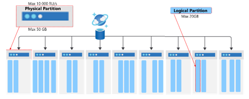
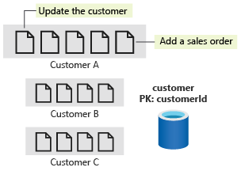

# Partition
1. The maximum storage size of a physical partition is 50 GB, and the maximum throughput is 10,000 RU/s. 
2. A logical partition max at 20GB.
3. A partition key is immutable (regardless if hierarchical or not)
4. Physical partition is split in 2 ways.
    - reach 50GB
    - if assign per 10k RU/s. E.g. assign 20k it will split 2 physical partition automatically.
5. Partition Key cannot be changed once created. To do it you need to migrate to a new container.

## Logical partitions in Azure Cosmos DB
A logical partition is an abstraction above the underlying physical partitions. Multiple logical partitions can be stored within a single physical partition. A container can have an unlimited number of logical partitions. Individual logical partitions are moved to new physical partitions as they grow in size to ensure optimum storage utilization and growth. Moving logical partitions as a unit ensures that all documents within it reside on the same physical partition. The maximum size for a logical partition is 20 GB. Using a partition key with high cardinality allows you to avoid this 20-GB limit by spreading your data across a larger number of logical partitions. You can also use hierarchical partition keys which organize partition key values in a hierarchy to avoid this limit. These are covered in another learning path.



*NOTE: If i do customer id as partition key; it does not mean it will create 1million logical partition. Logical partitions are a virtual concept, and there's no limit to how many logical partitions you can have. Azure Cosmos DB will collocate multiple logical partitions on the same physical partition. As logical partitions grow in number or in size, Cosmos DB will move them to new physical partitions when needed.

## Denormalization

When data share a partition key and have similar access patterns, they're candidates for being stored in the same container.  Example if we have customer and sales order, it's best to store in 1 container rather than seperate.

## Transaction / Store Procedure

https://learn.microsoft.com/en-us/training/modules/design-data-partitioning-strategy/5-denormalize-aggregates-same-container

Azure Cosmos DB supports transactions and store procedure when the data sits within the **same logical partition**.

There are two ways to implement transactions in Azure Cosmos DB: by using stored procedures or transactional batch, which is available in both .NET and Java SDKs. REMEMBER: Transactional batch to add a condition to check if it's already updated (e.g. WHERE metricsdeviceid = 1, so can update to 2).



## Strategies

| Partitioning strategy | When to use | Pros | Cons |
| -- | -- | -- | -- |
| Regular Partition Key (for example, CustomerId, OrderId) | Use when the partition key has high cardinality and aligns with query patterns (for example, filtering by CustomerId). Suitable for workloads where queries mostly target a single customer's data (for example, retrieving all orders for a customer). | Simple to manage. Efficient queries when the access pattern matches the partition key (for example, querying all orders by CustomerId). Prevents cross-partition queries if access patterns are consistent. | Risk of hot partitions if some values (for example, a few high-traffic customers) generate more data than others. Might hit the 20-GB limit per logical partition if data volume for a specific key grows rapidly. |
| Synthetic Partition Key (for example, CustomerId + OrderDate) | Use when no single field has both high cardinality and matches query patterns. Good for write-heavy workloads where data needs to be evenly distributed across physical partitions (for example, many orders placed on the same date). | Helps distribute data evenly across partitions, reducing hot partitions (for example, distributing orders by both CustomerId and OrderDate). Spreads writes across multiple partitions and improves throughput. | Queries that only filter by one field (for example, CustomerId only) could result in cross-partition queries. Cross-partition queries can lead to higher RU consumption (2-3 RU/s extra charge for every physical partition that exists) and added latency. |
| Hierarchical Partition Key (HPK) (for example, CustomerId/OrderId, StoreId/ProductId) | Use when you need multi-level partitioning to support large-scale datasets. Ideal when queries filter on first and second levels of the hierarchy. | Helps avoid the 20-GB limit by creating multiple levels of partitioning. Efficient querying on both hierarchical levels (for example, filtering first by CustomerID, then by OrderID). Minimizes cross-partition queries for queries targeting the top level (for example, retrieving all data from a specific CustomerID). | Requires careful planning to ensure the first-level key has high cardinality and is included in most queries. More complex to manage than a regular partition key. If queries don't align with the hierarchy (for example, filtering only by OrderID when CustomerID is the first level), query performance might suffer. |
| Global Secondary Index (GSI) - preview (for example, source uses CustomerId, GSI uses OrderId) | Use when you can't find a single partition key that works for all query patterns. Ideal for workloads that need to query by multiple independent properties efficiently and have a large number of physical partitions. | Eliminates cross-partition queries when using the GSI partition key. Allows multiple query patterns on the same data with automatic synchronization from source container. Performance isolation between workloads. | Each GSI has additional storage and RU costs. Data in the GSI is eventually consistent with source container. |

## Hierarchy partitioning

Cosmos DB introduced Hierarchical Partition Keys (also known as sub-partitioning) which allows you to define a composite partition key (e.g., /TenantId, /UserId). This feature allows you to exceed the 20 GB storage limit for a single tenant, and in practice, allows for higher throughput per-tenant by distributing a single "logical tenant" across multiple physical partitions. While this mechanism is designed to scale beyond the default limits, the hard limit for a single physical partition remains 10,000 RU/s.

Main idea is doesn't need to create a "synthetic" data. Now just create a indicate the new key it then concat both to calculate hashkey.

Support in:

- Portal
- Code
- ONLY NoSQL (others like mongodb etc are not supported)

**NOTE**: Only support up to 3 hierarchy level.
Is an advance concept and it's not a simple "synthetic key" (combine 2 key). It actually split logical partition after a hierarchical partitioning.

### Example 

| Feature | HPK: /country_id/user_id | Single Key: /user_id |
| -- | -- | -- |
| Hot Partition Fix | Yes (Load is spread by user) | Yes (Load is spread by user) |
Country-Specific Queries | Efficient (Single-partition scan of one country's data). | Inefficient (Cross-partition query scanning all countries). |
| User-Specific Queries | Highly Efficient (Single-partition lookup). | Highly Efficient (Single-partition lookup). |
| Tenant/Country Management | Excellent. Data for a country is logically grouped for reporting or regional management. | Poor. Country data is scattered across all physical partitions. |

** Write Performance (Solving the Hot Partition) - Excellent ✅
Problem Solved: The original hot partition was caused by Country 1 receiving all 25,000 RU/s on a single logical partition.

HPK Solution: By adding /user\_id as the secondary key, the load for Country 1 is now distributed across thousands of logical partitions, one for each unique user within that country.

Result: The 25,000 RU/s is now spread across many physical partitions, eliminating the hot spot and allowing the system to scale its write throughput.

## Max hierarchy partitioning

Here is a breakdown of the common purpose for each level:

### **Level 1**: Isolation and Administration (e.g., /TenantId)

Purpose: To group data for management, billing, and highly efficient queries scoped to the primary entity. This is your largest-grained separation.

Benefit: Enables single-partition queries for all operations within that tenant or country.

### **Level 2**: Distribution and Hot Partition Mitigation (e.g., /UserId)

Purpose: To provide the high cardinality necessary to distribute the throughput (RU/s) load within the Level 1 group, preventing hot partitions.

Benefit: Spreads the load of a large tenant across multiple logical partitions, allowing the single-tenant RU consumption to exceed the 10,000 RU/s limit of a single physical partition.

### **Level 3:** Storage Limit Evasion (e.g., /SessionId or /itemId)

Purpose: To prevent a single logical partition from exceeding the 20 GB storage limit, even for a single user/tenant combination.

Benefit: If you have a scenario where the combination of the first two keys (e.g., a single user's data in a single tenant) is expected to grow beyond 20 GB, adding a third key like a SessionId, OrderId, or even the item's id guarantees unlimited storage scale for that user's data by further breaking it into smaller, manageable logical partitions.

## Partition splitting

It means physical when the term "Partition split" and normally before reaching 50GB.

| Partition Type | Definition | Trigger for Split/Scaling |
| -- | -- | -- |
| Logical Partition | A conceptual unit of data that holds all items that share the same partition key value. e.g., all customer data where customerId = '12345'. | Does not split. Its maximum size is 20 GB and maximum throughput is 10,000 RU/s. If it exceeds these limits, it often indicates a poor partition key choice (a "hot" partition). |
| Physical Partition | The actual, internal hardware (storage and compute) managed by Cosmos DB that hosts one or more logical partitions. It's the unit of horizontal scale. | Splits when its total data storage (sum of all logical partitions it contains) reaches its maximum limit of 50 GB (or when the provisioned throughput requires more physical partitions). |

### How it works

If you have 1 physical partition (PP) and you have provisioned 30,000 RU/s, it splits to 3 physical partitions.

The Law of 10k: A single physical partition can never exceed 10,000 RU/s.

Automatic Splitting: If you assign 30,000 RU/s to a container, Cosmos DB will automatically create at least 3 physical partitions (30k / 10k = 3).

Now, let's look at your specific example:
Suppose your 10 logical partitions are distributed across these 3 physical partitions.

Physical Partition A: 10,000 RU/s (Contains Logical Partitions 1, 2, 3)

Physical Partition B: 10,000 RU/s (Contains Logical Partitions 4, 5, 6)

Physical Partition C: 10,000 RU/s (Contains Logical Partitions 7, 8, 9, 10)

If your queries cause a cost of 10,000 RU/s for just Logical Partition 1:

Yes, this is a hot partition. * Because Logical Partition 1 is on Physical Partition A, it is now consuming 100% of that partition's available bandwidth.

The Victim: If you try to query Logical Partition 2 or 3 (which are in the same "room" as the hot one), they will get 429 Throttling errors even though they aren't the ones being busy. This is called the "noisy neighbor" effect.

## Unique Keys

1. Partition Key is NOT unique.
2. Unique key are based on path.
3. Logical partition has to be unique. NOTE: the reason duplicates can still exist for unique path.
4. Unique key cannot be changed once container is created.
 
Unique Constraint = Partition Key Value + Unique Key Value

E.g.
Document | /sku (Unique Key) | /categoryId (Partition Key) | Combination (Must be Unique) | Result of Upsert/Insert
-- | -- | -- | -- | --
Doc A | SKU101 | CAT_A | SKU101 + CAT_A | Allowed
Doc B | SKU101 | CAT_B | SKU101 + CAT_B | Allowed (Different Partition Key)
Doc C | SKU101 | CAT_A | SKU101 + CAT_A | Blocked (Duplicate Combination)
Doc D | SKU102 | CAT_A | SKU102 + CAT_A | Allowed

# Partitioning logical/physical

1. Cosmos DB uses Hash-Based Partitioning.
2. To see range mapping to physical partitions, use *ReadPartitionKeyRangeFeedAsync*

## How partition and hot partition works

Every customerId is passed through a hash function that turns it into a number.

The total "hash space" is divided among your physical partitions.

The "Coincidence" Problem: Even if you have 1 million customers, if a large group of them (e.g., Customer_A through Customer_AAA) happens to hash into the same range, they all land on Physical Partition A.

If those specific customers all become active at the same time, they will collectively fight for the 10,000 RU/s limit of that physical server, even though they are technically different logical partitions.

## Null partition key

This is valid and apparently we can insert null on partition key, including hierarchical partition key.

To query a null partition via partition key however requires special method:
Hierarchy PK or just PK: pass []
SDK: PartitionKey.Null or PartitionKey.None

Indicate in ms-documentdb-partitionkey

## Throughput Redistribution

A new feature that allows Logical/Physical Partition to hit limit up-to 20k.

```bash
az cosmosdb sql container redistribute-partition-throughput \
    --account-name <account-name> \
    --resource-group <resource-group> \
    --database-name <database-name> \
    --name <container-name> \
    --target-partitions "0=15000 1=5000"
```

## Merging Partition

See Features section. As this is an account feature.

For some reason you have a long running container that has been assigned with large RU/s and was scaled up for a period later to have been clean-up and partition reduced, you can save 'cost' and 'performance' with merging. E.g. assigning 50,000RU/s the partition was split physically to 5, then data reduced with need of only 2,000RU/s and actually need only 1 partition; then use this.

Microsoft generally recommends merging when your container meets these two conditions:
1. Low Throughput: Your current RU/s per physical partition is < 3,000 RU/s.
2. Low Storage: Your current average storage per physical partition is < 20 GB.

Use command
```bash
az cosmosdb sql container merge --
```


## Logical vs Physical Partitioning

Physical partitioning is that it is AUTO. So when it reaches e.g. 50GB it partition out itself. But for logical there is a MAX.

| Feature | Logical Partition | Physical Partition |
| -- | -- | -- |
| Definition | A set of items that share the same partition key value. | An internal, managed unit of scale (compute and storage). |
| You Define | You choose the partition key that creates this logical boundary. | Cosmos DB manages this entirely; you cannot control its creation or placement. |
| Purpose | To group related data for efficient, single-partition queries and transactions. | To distribute data and provisioned throughput across multiple physical servers.
| Size Limit | 20 GB of data. (This is a hard limit you must design your partition key to avoid hitting). | 50 GB of data. |
| Throughput (RU) | Limit	10,000 RU/s. (Because it cannot span a physical partition, its limit is the physical partition's limit). | 10,000 RU/s. (This is the throughput capacity of a single physical server/node). |
| Mapping | One or more logical partitions are mapped to a single physical partition. | Contains one or more logical partitions. |

##Hacking physical partition to perform faster.

E.g. I want to ingest 1TB of data and i want it to be very very fast. So the max we can go is only 10k instead lets say if we can ingest at 25k (making 25 physical partition), the idea is to manual provision 25k RU then behind the scene it will create 25 physical partition, using this way we can maximize and pump data concurrently.

## No array in partition

Consider these if exam scenarios are having arrays as partition keys. If given question goes like "what is the most efficent partition key if 1 tenant can have 1000 customers and most query goes by tenant Id and customer Id". One of the anser is using hierarchy partition key of tenantId/customerId.

Given a JSON
```json
{
    "tenantId": "T1",
    "customers": [
        {
            "customerId": "C1",
            "purchases": [
                {
                    "purchaseId": "P1"
                }
            ]
 }]}
```

**Reality**: You can create partition key of only tenantId BUT NOT tenantId/customers/customerId as customerId is in an array. In real life it has to be flattened into something like:

```json
{
   "tenantId": "T1",
   "customerId": "C1",
   "purchases": [
    {
      "purchaseId": ""
    }
   ]
}
```

If need to even split into tenantId/customerId/purchaseId then purchaseId is required to be even flattened.

**NOTE**: Exam question sometimes assume flattening are handled externally and answer can be /tenantId/customerId eventhough the JSON given in exam is not possible.


