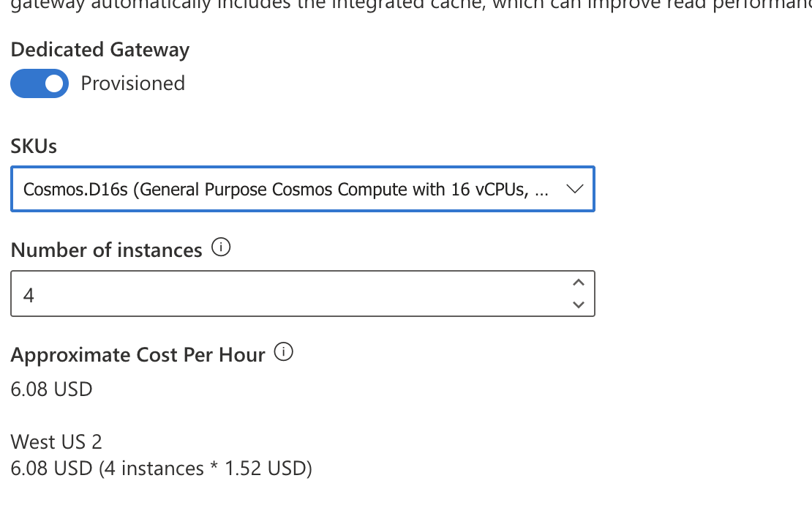

# Gateway Mode

| Connection mode | Supported protocol | Supported SDKs | API/Service port | Endpoint |
| -- | -- | -- | -- | -- |
| Gateway | HTTPS | All SDKs | SQL (443), MongoDB (10255), Table (443), Cassandra (10350), Graph (443) | <cosmos-acct>.sqlx.cosmos.azure.com |
| Direct | TCP | .NET SDK, Java SDK | When using public/service endpoints: ports in the 10000 through 20000 range. When using private endpoints: ports in the 0 through 65535 range | <cosmos-acct>.document.azure.com |

## 1. Gateway Mode (Standard Gateway)
This is the standard connectivity mode supported by all Cosmos DB SDKs and APIs.
- Protocol: Uses HTTPS over the standard port 443.
- Path: Your application sends the request to a shared, front-end Gateway Node, which then routes the request to the correct backend replica (partition).
- Latency & Performance: It involves an extra network hop, resulting in slightly higher latency compared to the low-latency Direct Mode (which uses TCP).
- Primary Use Case: Best for clients running in environments with strict corporate firewall restrictions where opening the wide range of TCP ports required by Direct Mode is not feasible.
- Caching: No built-in caching. This mode is a routing/proxy layer, not a cache layer.

## Integrated Cache: The cache is automatically configured on the Dedicated Gateway.
**Key Requirement:** To use the Integrated Cache, you must use the **Dedicated Gateway endpoint** and connect in **Gateway Mode** with a consistency level of **Session** or **Eventual**.

1. It is an in-memory, read-through, write-through cache.
2. It can cache both point reads and query results.
3. Requests that hit the cache consume 0 Request Units (RUs), significantly reducing cost for read-heavy, repeated access workloads.
4. Path: Your application connects to the Dedicated Gateway endpoint using Gateway Mode (HTTPS on port 443). The gateway node checks its cache and either serves the data instantly (cache hit) or routes the request to the backend (cache miss).
5. Latency: Requests served from the cache have very low latency. Even requests bypassing the cache are often slightly lower and more consistent than the Standard Gateway.


## Gateway Mode with Redis Cache
Implement however you like. Redis is one example of a custom server to implement cache in Gateway Mode.

| Feature | Gateway Mode (Standard) | Gateway Mode with Integrated Cache |
| -- | -- | -- |
| Gateway Type | Shared (Standard Gateway) | Dedicated (Provisioned Compute) |
| Cache Built-in | No | Yes (In-memory, RU-free) |
| Primary Goal | Firewall compatibility (HTTPS 443) | Read performance and Cost reduction |
| Latency | Higher (extra network hop) | Very low on cache hits |
| Cost | No extra charge for the gateway | Billed hourly for the dedicated gateway compute |

## Cache Staleness

In codes there is an option required: **DedicatedGatewayRequestOptions**, which can set
`DedicatedGatewayRequestOptions.MaxIntegratedCacheStaleness`

1. The minimum MaxIntegratedCacheStaleness value is 0 and the maximum value is 10 years. When not explicitly configured, the 
2. MaxIntegratedCacheStaleness defaults to 5 minutes.
3. This is item level with ItemRequestOptions

## Connection Limit

1. Connection control uses *GatewayModeMaxConnectionLimit*.
2. Gateway skips hop and it's fast but you may experience error 503 or 408 timeout as gateway has limitations. Request limit is 60seconds/1min.

## To Use Gateway Caching

1. Endpoint - Client code must point to gateway which is sqlx.cosmos.azure.com
2. Connectivity Mode - Change to ConnectionMode.Gateway
3. Session - The integrated cache supports read requests with **session** and **eventual** [consistency](https://learn.microsoft.com/en-us/azure/cosmos-db/consistency-levels) only. If a read has consistent prefix, bounded staleness, or strong consistency, it bypasses the integrated cache and is served from the backend.
4. Role - Ensure that your application has a managed identity enabled and that the managed identity has been granted the **Cosmos DB Built-in Data Contributor role** on the Azure Cosmos DB account.  Because it needs to write session and cache. Reader does not allow this.
5. Monitor - You can check if it's using cache in Metrics and monitor IntegratedCacheItemHitRate and IntegratedCacheQueryHitRate.
6. Disabling - Set BypassIntegratedCache = true in DedicatedGatewayRequestOptions. If you want to disable per item, then configure MaxIntegratedCacheStaleness

## Bypass cache

Required to be set via SDK with BypassIntegratedCache keyword:

```C#
FeedIterator<MyClass> myQuery = container.GetItemQueryIterator<MyClass>(new QueryDefinition("SELECT * FROM c"), requestOptions: new QueryRequestOptions
        {
            DedicatedGatewayRequestOptions = new DedicatedGatewayRequestOptions 
            { 
                BypassIntegratedCache = true
            }
        }
);
```

## SDK Caching for Java

Just fyi, SDK in .NET have auto enabled caching, in java need to set `CosmosQueryRequestOption.setQueryPlanCachingEnabled(true)`

## Gateway request volume
Eventhough if connection mode is using Direct TCP, "Total Gateway Request Volume" will still display. Things like metadata request and container/database creation, delete or update are ran thru Gateway.

## SKU for Dedicated Gateway.

CosmosDB Gateway is not Azure Gateway. The SKU can on instance and CPU only (4,8,16). There are settings available for:
- CORS
- Cache duration - default 5 seconds

