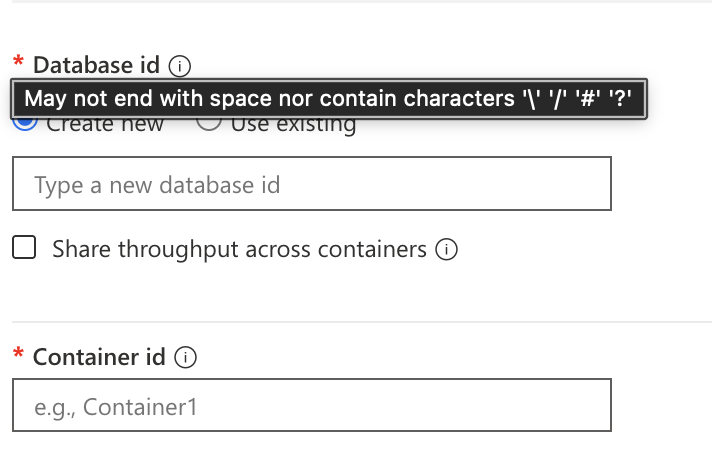

# Overview
Historically it was called DocumentDB, due to marketing it was renamed. Roles and some APIs still uses DocumentDB.

## Database Types
There are 5 types of database in Azure Cosmos DB:

  1. SQL (Core) API (exam primarily focus on this)
  2. MongoDB API
  3. Cassandra API
  4. Gremlin API
  5. Table API

## Hierarchy
An "Account" is the primary distribution/availability.

```
Account (replication, consistency)
  -> Database (throughput)
    -> Container (all throughput)
      -> Item
```

## Scope of Control
Scope of Control | Replication (Regions) | Consistency Level (Default) | Consistency Level (Override)
-- | -- | -- | --
Account Level | YES (Add/Remove Regions, Single/Multi-write setting) | YES (Sets the default for everything) | NO (Only for individual requests)
DB / Container Level | NO | NO | NO
Request Level | NO | NO | YES (Can relax the account default for reads)

## Capacity Mode
### Serverless
- Serverless compute integration
- **ONLY** max 1TB per container
- **NO** Geo replication
- Performance on write slower, 30ms vs 10ms on write. Read is 10ms on both Provisioned and Serverless.
- Billing is pay per-use compared to per-hour.
- Cannot do **periodic backup** only **continuous backup**. 
- MAX at 5000 RU per **physical** partition in a container. 

### Provisioned throughput
- Unlimited storage.
- Split to:
  - **Manual**
    - much cheaper 0.8 per RU/s
  - **Autoscale** 
    - expensive at 0.12 per RU/s
    - billing is charged per/hour on the highest/max

### Switching Capacity Mode
You **can** switch a Cosmos DB account from Serverless to Provisioned Throughput (either Manual or Autoscale).
You **cannot** switch a Cosmos DB account back from Provisioned Throughput to Serverless. This is an irreversible operation.

## Differences of VCore/RU and Managed Instance
Just glance thru, the exam focuses more on RU.
Difference between RU and Managed/VCore is replication:

| Feature | vCore-based Model (Dedicated Instances) | RU-based Model (Shared Throughput) |
| -- | -- | -- |
| In-Region HA | Manual/Synchronous. You must explicitly enable High Availability (HA) for production clusters. When enabled, each shard maintains a hot-standby replica in a different Availability Zone (AZ). Replication between primary and standby is synchronous, guaranteeing zero data loss on failover. | Automatic/Synchronous (Behind the scenes). Data is automatically replicated across fault domains and upgrade domains within a region. The service manages this process transparently to provide high availability. |
| Cross-Region Replication | Active-Passive (Asynchronous). You create a read-only replica cluster in a different region. Data is replicated asynchronously from the primary cluster to the replica. You must manually promote the replica to become the new primary in the event of a regional disaster (Disaster Recovery). | Active-Active (Synchronous/Asynchronous). You can configure multi-region writes (active-active) where every region can accept writes. The internal replication is handled by the platform, offering a choice of five consistency levels (Strong, Bounded Staleness, Session, Consistent Prefix, Eventual). |
| Sharding | Supports sharding to scale the cluster horizontally with a vCore-based architecture familiar to native MongoDB users. | Supports automatic, server-side sharding for "limitless" horizontal scalability, with the service managing shard creation and balancing. |
| Disaster Recovery | Requires manual promotion of a cross-region replica. As replication is asynchronous, there is a possibility of minimal data loss if the primary region fails before the last few writes are replicated. | Offers automatic regional failover and recovery with no downtime for multi-region write accounts, depending on the chosen consistency level. |
| Consistency Control | Adheres to the consistency models of the underlying MongoDB architecture (typically **Strong Consistency** within a replica set/shard, **but Eventual Consistency for cross-region reads)**. | Offers five tunable consistency levels (**Strong, Bounded Staleness, Session, Consistent Prefix, and Eventual**) to balance performance and data fidelity. |


## VCore

VCore are only featured for MongoDB and PostgreSQL
PostgreSQL is only vCore (no RU) where a fixed vCPU/RAM is assigned.


| Feature | vCore-based Model | RU-based Model (Provisioned/Autoscale/Serverless) |
| -- | -- | -- |
| Primary Resource | Dedicated compute resources (vCPUs, RAM, and Storage). | Throughput expressed in Request Units (RUs) per second. |
| Billing | Consistent flat fee based on provisioned vCores/nodes and storage. | Based on RUs: either a fixed amount (Provisioned) or RUs consumed (Serverless). |
| Scaling | Vertical and horizontal scaling of cluster tiers (vCPUs/RAM/Storage). | Limitless horizontal scaling based on RUs and data size. |
| Workload Focus | Predictable performance, complex queries, and lift-and-shift migrations. | Cloud-native apps, high-volume point reads, and instantaneous scaling. |
| Availability | Typically offers 99.995% SLA. | Offers an industry-leading 99.999% SLA for mission-critical apps. |

## Managed Instance

Cassandara has Managed Instance(Virtual Machine to run so need choose SKU) and RU(choose throughput) only.

| Feature | Azure Managed Instance for Apache Cassandra | Azure Cosmos DB for Apache Cassandra (RU/s) |
| -- | -- | -- |
| Underlying Platform | Pure open-source Apache Cassandra. You can use native features. | Azure Cosmos DB's cloud-native engine, with a Cassandra-compatible API layer. |
| Pricing Model | Instance-based (billed by the number and size of Virtual Machines/nodes). | Throughput-based (billed by Request Units per second or RU/s). |
| Compatibility | 100% feature-compatible with native Apache Cassandra. Best for lift-and-shift. | High wire-protocol compatibility, but behaves differently (e.g., no compaction). |
| Scaling | Scale by adding or removing VM nodes; scaling is managed but involves VM-level operations. | Scales elastically and instantly by increasing or decreasing the provisioned RU/s. |

## Concept of VCore / Managed Instance
| Concept | Explanation |
| -- | -- |
| A Managed Instance is defined by vCores. | When you provision a Managed Instance, you must select the vCore purchasing model. You then choose the number of vCores (e.g., 8 vCores, 16 vCores) to power that instance. |
| vCores are the engine; the Managed Instance is the car. | The Managed Instance provides the feature set (the "SQL Server experience"), and the vCores provide the performance (the CPU and RAM). |

## Shared Throughput

After the first 25 containers, you can add more containers to the database only if they're [provisioned with dedicated throughput](https://learn.microsoft.com/en-us/azure/cosmos-db/set-throughput#set-throughput-on-a-database-and-a-container), which is separate from the shared throughput of the database.



| Parameter | Standard (manual) throughput on a database | Standard (manual) throughput on a container | Autoscale throughput on a database | Autoscale throughput on a container |
| -- | -- | -- | -- | -- |
| Entry point (minimum RU/s) | 400 RU/s. Can have up to 25 containers with no RU/s minimum per container. | 400 | Autoscale between 100 - 1000 RU/s. Can have up to 25 containers with no RU/s minimum per container. | Autoscale between 100 - 1000 RU/s. |
| Minimum RU/s per container | -- | 400 | -- | Autoscale between 100 - 1000 RU/s
Maximum RUs | Unlimited, on the database. | Unlimited, on the container. | Unlimited, on the database. | Unlimited, on the container. |
| RUs assigned or available to a specific container | No guarantees. RUs assigned to a given container depend on the properties. Properties can be the choice of partition keys of containers that share the throughput, the distribution of the workload, and the number of containers. | All the RUs configured on the container are exclusively reserved for the container. | No guarantees. RUs assigned to a given container depend on the properties. Properties can be the choice of partition keys of containers that share the throughput, the distribution of the workload, and the number of containers. | All the RUs configured on the container are exclusively reserved for the container. |
| Maximum storage for a container | Unlimited | Unlimited | Unlimited | Unlimited |
| Maximum throughput per logical partition of a container | 10K RU/s | 10K RU/s | 10K RU/s | 10K RU/s |
| Maximum storage (data + index) per logical partition of a container | 20 GB | 20 GB | 20 GB | 20 GB |

## FREE Tier

Yes, there is a Lifetime Free Tier
You must opt-in: You must explicitly choose the Free Tier discount when you create the Azure Cosmos DB account.

One per subscription: You are limited to one Free Tier account per Azure subscription.

Duration: The free tier lasts for the lifetime of that specific Cosmos DB account. It does not expire after 12 months like the general Azure Free Account.

| Resource | Free Tier Limit | Cost Implication |
| -- | -- | -- |
| Throughput (RU/s) | The first 1,000 RU/s provisioned. | FREE |
| Storage | The first 25 GB of data storage. | FREE |

Only first 1k and 25G, if exceed will charge as normal.

## Autoscale provisioning

Why not manual since auto is great:
1. more expensive 0.12.
2. billing is charged per/hour on the highest/max. E.g. if normally you use only 4k RU but one second peak of 6k the whole hour charge is 6k RU/s.

## How to set the maximum autoscale
1. Min is always set 10% of the max. So 1000 RU is 100 minimum RU.
2. Setting highest like 99999 have implications. E.g. You set 10k max RU, if your average RU is using only 4k is actually used but you are always billed at 10k. It's because the buffer allow too much spike and even 1 second 10k your bill goes insane expensive. The best is to set about 4.5k or 5k and billing can be saved.

## Limit
This is as of 2026

Resource | Your Value | Current 2026 Limit | Note
-- | -- | -- | --
Account (per Sub) | 50 | 250 | The default is now 250, but it can be increased via support ticket to 1,000.
Databases + Containers | 500 / 25 | 500 Total | This is a combined limit per account (e.g., 10 DBs and 490 Containers).
Containers (Shared DB) | 25 | 25 | Only applies to databases using Shared Throughput. Dedicated containers are unlimited (up to the 500 account limit).
Max RU per Partition | 10,000 | 10,000 RU/s | This applies to both Logical and Physical partitions.
Logical Partition Size | 20GB | 20GB | This is a hard limit. Exceeding this triggers a "Partition Key reached maximum size" error.
Physical Partition Size | 50GB | 50GB | When a physical partition hits 50GB, Cosmos DB automatically performs a "Partition Split."