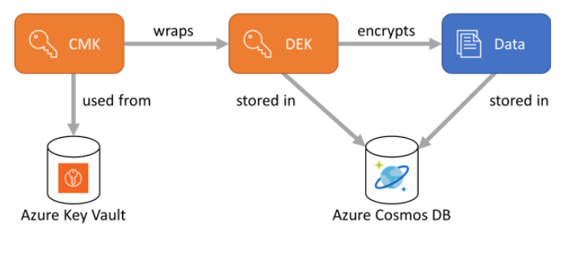

# Security And Encryption

## Security
### To monitor security
To monitor changes to Azure Cosmos DB use:
1. Activity Logs
2. Resource Logs, required to use Microsoft Defender for Cloud and Azure Policy to enable resource logs and log data collecting. Under diagnostic setting -> enable auditing.

### Lockdown
Prevent them from changing any property for the Azure Cosmos accounts, databases, containers, and throughput.

### Access Control
1. Block all IP Address
  - Because by default Azure Cosmos DB allows access to all incoming IPs.
  - Firewall can be enabled to prevent ip addresses.
2. Use private endpoint.
3. Use service endpoints.

### Networking

#### 1. Service Endpoints
Service Endpoints "wrap" the public endpoint of Cosmos DB. They allow your VNet to talk to the service using its private identity, but the destination is still the public IP of the Cosmos DB service.

Best for: Scenarios where you only need to grant access to specific Azure Subnets.

Specific IP Range Handling: You use the Cosmos DB Firewall to add the VNet/Subnet or specific public IP ranges.

Advantage: It is completely free and much easier to set up because you don't have to manage private DNS records.

**Disadvantage**: Traffic from your local office (on-premises) cannot use the Service Endpoint; those office IPs would have to be whitelisted in the public firewall, and the traffic would technically travel to a public IP.

#### 2. Private Endpoints (Private Link)
A Private Endpoint "injects" your Cosmos DB account into your VNet. It gets a private IP (e.g., 10.0.0.5) from your own subnet.

Best for: Maximum security and hybrid environments.

Specific IP Range Handling: Since the Cosmos DB now has a private IP, you don't use the "IP Firewall" in the same way. Instead, you use Network Security Groups (NSGs) to allow or deny specific IP ranges from reaching that private IP.

Advantage: Total Isolation. You can disable all public network access entirely. If your "specific IP ranges" are internal (e.g., connected via VPN), they can reach Cosmos DB without ever touching a public entry point.
+1

**Disadvantage**: There is a small cost associated with the endpoint and the data processed.

## Encryption
- There are 2 CMK encryption, 1 is whole DB and the 2nd is only certain fields(known as always Encrypt with DEK).
- DEK is store in CosmosDB Database (service), it can only be added to NEW Container
- CMK is stored in Azure Key Vault

Default Encryption: AES-256



#### DEK
Always encrypted requires that you create data encryption keys (DEK) ahead of time. 
- The DEKs are created at client-side using the Azure Comsos DB SDK. 
- These DEKs are stored in the Azure Cosmos DB service. 
- The DEKs are defined at the database level so they can be shared across multiple containers. 
- Each DEK you create can be used to encrypt  **can be used to encrypt many properties** or **only one property**. You can **have multiple DEKs per databases**.
- The path of the property in the form of /property. Only top-level paths are currently supported, nested paths such as /path/to/property aren't supported.

#### Customer-managed keys

A DEK must be wrapped by a customer-managed key (CMK) before it stored in Azure Cosmos DB. Since CMKs control the wrapping and unwrapping of the DEKs, they control the access to the data that is encrypted with those DEKs. CMK storage is designed as an extensible/plug-in model, with a default implementation that expects them to be stored in Azure Key Vault. 

### Encryption Policy

- has account level(CMK), db level(DEK key) and container.
- In the current release, you must create these policies at the container creation time and can't be updated once they're created.
- The path of the property in the form of /property (no other), no nested.
- You can't encrypt the ID or the container's partition key.
- Encrypted properties can only be used in **equality** filters (WHERE c.property = @Value). Any other usage will return unpredictable and wrong query results.
- Two types of encryption
  * Deterministic encryption: It always generates the same encrypted value for any given plain text value and encryption configuration. Using deterministic encryption allows queries to do equality filters on encrypted properties. However, it may allow attackers to guess information about encrypted values by examining patterns in the encrypted property. This is especially true if there's a small set of possible encrypted values, such as True/False, or North/South/East/West region.
  * Randomized encryption: It uses a method that encrypts data in a less predictable manner. Randomized encryption is more secure, but prevents queries from **filtering** on encrypted properties. CANNOT BE SEARCHED.


```
var path1 = new ClientEncryptionIncludedPath
{
    Path = "/property1",
    ClientEncryptionKeyId = "my-key",
    EncryptionType = EncryptionType.Deterministic.ToString(),
    EncryptionAlgorithm = DataEncryptionKeyAlgorithm.AEAD_AES_256_CBC_HMAC_SHA256.ToString()
};
var path2 = new ClientEncryptionIncludedPath
{
    Path = "/property2",
    ClientEncryptionKeyId = "my-key",
    EncryptionType = EncryptionType.Randomized.ToString(),
    EncryptionAlgorithm = DataEncryptionKeyAlgorithm.AEAD_AES_256_CBC_HMAC_SHA256.ToString()
};
await database.DefineContainer("my-container", "/partition-key")
    .WithClientEncryptionPolicy()
    .WithIncludedPath(path1)
    .WithIncludedPath(path2)
    .Attach()
    .CreateAsync();
```

### Key Vault

https://microsoftlearning.github.io/dp-420-cosmos-db-dev/instructions/28-key-vault.html
https://learn.microsoft.com/en-us/training/modules/implement-security-azure-cosmos-db-sql-api/6-understand-always-encrypted

### Permission required to use KeyVault
To use Key Vault, the application needs the following permissions:

- Get
- Wrap
- Unwrap

### Data Encryption Key (DEK) are cached.
You enable server-side encryption with CMK for an account. After the CMK is disabled in Azure Key Vault, new writes fail. Read requests still succeed. Why are reads unaffected?

Write needs to create DEK, on the fly, while read uses cached DEK. Though read will eventually fail, about few hours.

### Reading documents when only a subset of properties can be decrypted.

Just read property where you have access to.

In situations where the client does not have access to all the CMK used to encrypt properties, only a subset of properties can be decrypted when data is read back. For example, if property1 was encrypted with key1 and property2 was encrypted with key2, a client application that only has access to key1 can still read data, but not property2. In such a case, you must read your data through SQL queries and project away the properties that the client can't decrypt: SELECT c.property1, c.property3 FROM c.

### Encrypt Steps

1. This is only to encrypt certain fields.
2. Also known as client-side encryption and need to use SDK.

https://learn.microsoft.com/en-us/azure/cosmos-db/how-to-always-encrypted?context=%2Fazure%2Fcosmos-db%2Fcontext%2Fcontext&tabs=dotnet

1. Create a *Customer Managed Key (CMK)* encryption in Azure Key Vault. This encryption is used for encrypting.
2. Define access for Cosmos DB to access Azure Key Vault.
3. Use the SDK to create the DEK (with the CMK) on a database.
4. Create the container with encryption policy. Encryption policy can only be added during container creation.


### Encrypt whole DB with CMK

1. This is global encryption to the whole account, hence CMK is defined DURING account creation.
2. Also know as server-side encryption
3. This encryption is ONE way. Means once in CMK cannot switch back to Microsoft Managed, also CMK can only be rotated in KeyVault.
4. Double encryption, once in Microsoft Managed then re-encrypt with CMK.

https://learn.microsoft.com/en-us/azure/cosmos-db/how-to-setup-customer-managed-keys?context=%2Fazure%2Fcosmos-db%2Fcontext%2Fcontext&tabs=azure-portal

1. Create a *Customer Managed Key (CMK)* encryption in Azure Key Vault. This encryption is used for encrypting.
2. Create a CosmosDB Account (choose CMK)
3. Define access for Cosmos DB to access Azure Key Vault.
