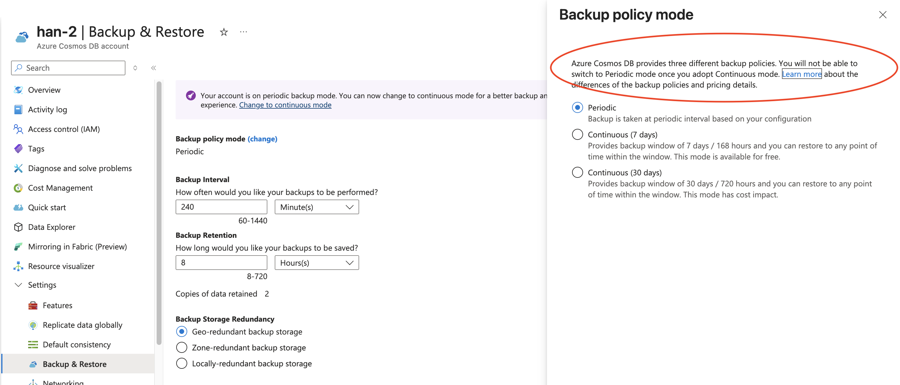

# Backup
There are only 2 backup modes:
1. Continuous Backup
2. Periodic Backup

## Roles

Cosmos DB Backup Operator- can only backup db
Cosmos DB Restore Operator - can only restore from Db, but requires Cosmos Db operator else cannot create new container
Cosmos DB Operator - creates account, db and container. But cannot view data.

## Periodic backup

(you cannot change a Cosmos DB account with continuous backup back to periodic backup mode.)
 
- Backup Interval - This setting defines how often is the backup going to be done. Can be changed in minutes or hours. The interval period can be between 1 and 24 hours. The default is 240 minutes (4 hours).
- Backup Copies - By default only the last 2 are stored.
- Backup Retention - This setting defines how long should the backups be kept. Can be changed in hours or days. The retention period will be at **least two times the backup interval** and 720 hours (or 30 days) at the most. The default is 8 Hours. Maximum is 30 days.
- Backup storage redundancy - One of the three redundancy options - LRS, ZRS, GRS. The default is Geo-redundant backup storage.
- No RUs is consumed for backup.
- Backup charges - first 2 backups storage are free.

**Notes**:
- A **full backup is taken every 4 hours**. Only the **last two backups** are stored by default. Both the backup interval and the retention period can be configured in the Azure portal. This configuration can be set during or after the Azure Cosmos DB account has been created.
- If Azure Cosmos DB's containers or database are deleted, the existing container and database **snapshots will be retained for 30 days.**
- Azure Cosmos DB backups are stored in **Azure Blob storage**.
- Backups are **stored** in the current **write region or if using multi-region writes** to one of the write regions to guarantee low latency.
- Snapshots of the backup are **replicated to another region through geo-redundant storage (GRS)** by default. This replication provides resiliency against regional disasters. Can be changed to **ZRS** or **LRS**.
- Backups **can't be accessed directly**. **To restore the backup, a support ticket needs to be opened** with the Azure Cosmos DB team.
- Backups won't affect performance or availability. Furthermore, **no RUs are consumed during the backup** process.

By default, locally redundant storage accounts are used to store the backups in each region. When Availability zones are enabled for a region, the backups are then stored in a Zone-Redundant storage account. This storage redundancy can't be updated when using the continuous backup mode.

## Continuous backup
- only 7 days free or 30 days
- You can do your own POINT-IN-TIME restoration compared to periodic (no ticket). For Azure Cosmos DB restores, you never restore on top of and existing account, and will always have to create a new Azure Cosmos DB account.
- Only deleted databases, containers can be restored to the SAME ACCOUNT. Otherwise, data/account restoration have to be in new account.

### Limitations when using the continuous backup mode
See - https://learn.microsoft.com/en-us/azure/cosmos-db/continuous-backup-restore-introduction?context=%2Fazure%2Fcosmos-db%2Fcontext%2Fcontext#understand-multi-region-write-account-restore

- Azure Cosmos DB accounts using customer-managed keys without permission aren't supported.
- Multi-region write accounts not supported. (NOW SUPPORTED - https://learn.microsoft.com/en-sg/azure/cosmos-db/continuous-backup-restore-introduction?context=%2Fazure%2Fcosmos-db%2Fnosql%2Fcontext%2Fcontext#understand-multi-region-write-account-restore)
- You can't restore an account into a region where the source account didn't exist.
- The retention period is 7 or 30 days and can't be changed.
- Restoration is up to seconds precision.
- Can't modify or delete IAM policies when restore is in progress.
- Accounts that create unique indexes after the container is created aren't supported.
- Point in time restore always restores to a new Azure Cosmos DB account.(with condition)
- Collection's consistent indexes may still be rebuilding after completing the restore.
- Since TTL container properties are restored with the restore process(if restore container the TTL properties are restored as well), restores must be for timestamps before TTL properties were added to a container. This timestamp will prevent data from being deleted right after the restore, else it get deleted immediately. You can to set --disable-ttl to prevent deletion with restore property.
- Currently, customers that disabled Synapse Link (deprecated) from containers can't migrate to continuous backup. And analytical store isn't included in backups.
- NO Cassandra support.
- NO SHARED THROUGHPUT CONTAINER RESTORE. A **subset of containers under a shared throughput database** can't be restored. The entire database can be restored as a whole.

If you did not disable Multi-region writes when you created your Azure Cosmos DB account, you will need to do it now or enabling the continuous backup feature will fail. You can disable multi-region writes unde the Replicate data globally Settings section.

## Request to restore a backup

### Periodic
If you need to restore a database or container, you'll need to **open a request ticket or call the Azure support team.** Azure support is available for all plans except for the Basic plan. You must have Azure Cosmos DB owner, contributor, or have the Cosmos DB Operator (CosmosdbBackupOperator) role assigned to request a restore from the portal.

NOTE: 
1. CosmosdbBackupOperator is the only one who can request.
2. Basic plan cannot restore db.

### Continuous/Point in Time Restore
Restore Scenarios
Let's review several point-in-times restores scenarios:
- **Restore deleted account** - Deleted accounts that can be restored are visible in the Restore pane under the Azure Cosmos DB account list page. The information needed for the restore is the timestamp right before the delete, the account name of the deleted account, and the target name to be restored as. Restores can be performed from the Azure portal, PowerShell, or CLI.
- **Restore data of an account in a particular region** - If you need a copy in a region of an Azure Cosmos DB Account you can do a point in time restore of the account. The information needed for the restore is the desired timestamp, and the target name to be restored as. Restores can be performed from the Azure portal, PowerShell, or CLI.
- **Recover from an accidental write or delete operation within a container with a known restore timestamp** - If you know the timestamp when the accidental operation was done, you can do a point in time restore from Azure portal, PowerShell, or CLI into another account at the desired timestamp to recover to.
**Restore an account to a previous point in time before the accidental delete of the database** - Under the point in time page, use the event feed pane to determine when the database was deleted, and find the restore time. You can do a point in time restore from Azure portal, PowerShell, or CLI into another account at the desired timestamp to recover to.
- **Restore an account to a previous point in time before the accidental delete or modification of the container properties** - Under the point in time page, use the event feed pane to determine when the container was created, modified, or deleted and find the restore time. You can do a point in time restore from Azure portal, PowerShell, or CLI into another account at the desired timestamp to recover to.

## Backup restore

Backup does not restore:
- VNET access control lists
- Stored procedures, triggers, and user-defined functions
- Multi-region settings
- Consistency settings. By default, the account is restored with *session* consistency.

OR you can say it can only restore
1. Cosmos DB account. A new Azure Cosmos DB account is created to hold the data every time you restore a backup. Data can't be restored to an existing Azure DB account. The account created will have the <Azure_Cosmos_account_original_name>-restored# name format, where # is an incremental digit when you're doing multiple restores against the same account. *NEVER recreate it*
3. Azure Cosmos DB database
4. Azure Cosmos DB database -> containers
5. Items within a container.  *If your retention period is set to anything less that seven days, it's a good practice to temporarily increase your retention period to at least seven days to make sure your backups aren't overwritten while you open the support ticket.*

NOTE: For periodic backup restore, do not create the same CosmosDBAccount. If you delete the Azure Cosmos DB account, and wish to recover it with the same name, don't recreate it. Just ask the Azure support team to **recreate it with the original name**. The restored account will have the same **provisioned throughput, indexing policies, and will be in the same region** as the original account.

## Backup notes
- Backup can only restore to same region but not necessary same account.
- Only cassandara cannot backup with Continous backup! (But periodic is ok)
- 2 roles required "CosmosDBOperator"(permission to write) and "CosmosRestoreOperator" permission to restore.
- Serverless cannot do periodic backup only continuous. NO DOCUMENTATION BUT YES it doesn't. Why??

Learn: https://microsoftlearning.github.io/dp-420-cosmos-db-dev/instructions/27-backup-recover.html

## Continuous Backup vs Periodic

Continuous has only
- 7 days (Free)
- 30 days
Continuous is only Zone/Local. You can achieve geo backup only and if geo-write is enabled.

Periodic (Custom) by hours and store for days.
Periodic have configuration for:
 - Need specify Retention(1-30 days) and Interval(1-24 hours)
 - Geo redundant, even not multi-region it can be geo backup
 - Zone redundant
 - Locally redundant

 ## Recovery caveat

CMK and Recovery
If the database or account was encrypted with CMK at the time of the backup, the ability to restore and access the data depends entirely on the availability and access to the necessary encryption key.

Scenario 1: You have the new CMK (Key 2) AND the old CMK (Key 1).

Yes, you can recover. When CMK is rotated (Key 1 is replaced with Key 2), the data is typically re-encrypted over time. However, the service maintains the ability to use the older key to decrypt data encrypted with it, especially for backups taken before the rotation was complete.

For a Point-in-Time Restore (PITR) in Azure Cosmos DB, the restore operation usually requires that the target account's identity has access to all the necessary key versions (both old and new) that were used to encrypt the data in the backup time range.

Scenario 2: You only have the new CMK (Key 2) but the database was using the old CMK (Key 1) at the backup time.

Recovery is uncertain or may fail for data encrypted with Key 1. If a backup was taken while the database was encrypted with Key 1, and Key 1 is now deleted or permanently inaccessible (e.g., revoked permissions, key vault deleted without soft-delete), you won't be able to decrypt the data protected by Key 1, and the recovery will likely fail or the restored data will be inaccessible. The backup itself is encrypted with the key active at that time.

Scenario 3: You have rotated the key (Key 2 is in use) and take a new backup.

Yes, recovery is possible. Any new backups taken after the key change will be encrypted with Key 2. As long as Key 2 is available and the account's managed identity has the correct Get, Wrap Key, and Unwrap Key permissions on the Azure Key Vault, the restore will succeed.

## Redundancy 

### Periodic
There are option for redundancy for
- GRS (total 6, 3 copies in primary region, 3 more in secondary)
- ZRS (total 3 copies, although ZRS is 3 and above )
- LRS (total 3 copy in 1 single location)

### Continuous
1. Cannot be set
- set as ZRS (IF AND ONLY IF Region support it, like for malaysia no ZRS) and Availability Zone is selected (option when creating account).
- always stored automatically as LRS per region.
2. Region do happen if multi-region is added. But remember backup can only restore to same region so there is only ZRS.
3. If consistency of Strong bounded, the write region backups only that are confirmed (approved by all regions).