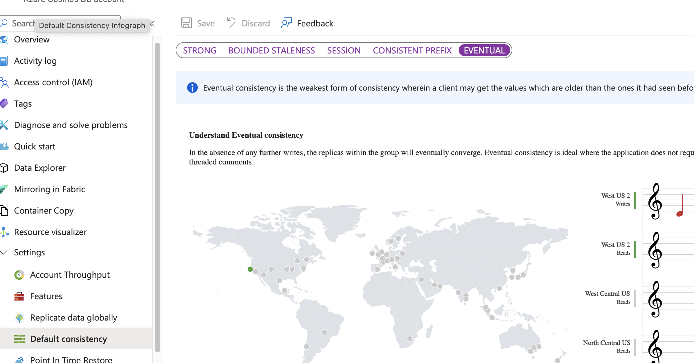

# Consistency
https://learn.microsoft.com/en-us/azure/cosmos-db/consistency-levels

| Consistency Level | Guarantee | Trade-off | Ideal Use Case |
| -- | -- | -- | -- |
| 1. Strong | Highest | Reads are guaranteed to return the most recent committed write. All replicas are synchronized synchronously.	Lowest Performance. Highest latency (especially across regions) and lowest throughput, as every write must be acknowledged by all replicas. | Financial transactions, inventory management where absolute data accuracy is non-negotiable. |
| 2. Bounded Staleness | High | Reads are guaranteed to lag behind writes by no more than K versions of the item or T time interval (e.g., 5 seconds). | Low Performance. Still incurs high latency, but better than Strong since a full quorum isn't required for every read.	Collaborative editing, task scheduling where near-real-time accuracy is required. |
| 3. Session | Moderate (Default) | Guarantees monotonic reads, monotonic writes, read-your-own-writes, and write-follows-reads within a single client session. | Good Performance. Excellent balance of consistency and speed; lower latency than Strong/Bounded Staleness. | User-centric applications like social media, shopping carts, and user profiles. |
| 4. Consistent Prefix | Low | Guarantees that reads never see out-of-order writes. If writes happen in order A, B, C, a reader may see A or A, B, or A, B, C, but never C, A, B. | High Performance. Low latency and high availability.	Logging, event sourcing, or distributed queues where order is critical but immediacy is not. |
| 5. Eventual | Lowest | No guarantees on the order or time it takes for a write to be replicated. Replicas will eventually converge. Order can be inconsistent. | Highest Performance. Lowest read latency and highest read throughput.	Non-critical data like social media likes/comments, usage logs, or high-volume telemetry data. |

## Configurations

1. Consistency is at **Account** level! 
2. Can be changed per request via SDK for read consistency. Write is **FIXED** with account level.



## SDK

1. Consistency can be change per request.
2. Consistency can only be relax not strengthen. Means if account is Session, cannot set as Strong but can go Eventually.
3. Session token can be pulled from response and then put as request. In SDK this is already handled.
4. The ConsistencyLevel for SDK setting is only used to only weaken the consistency level for reads. It can't be strengthened or applied to writes.


**Example**
```c#
ItemRequestOptions options = new()
{ 
    ConsistencyLevel = ConsistencyLevel.Eventual 
};
```

**Example to pull token**
```c#
# SDK actually handles this, but this is only for example.
ItemResponse<Product> response = await container.CreateItemAsync<Product>(item);
string token = response.Headers.Session;
ItemRequestOptions options = new()
{ 
    SessionToken = token
};
ItemResponse<Product> readResponse = container.ReadItemAsync<Product>(id, partitionKey, requestOptions: options);)
```

## Multi Region restriction

Strong consistency is strongest it can support is, but it **CANNOT** be supported in a _multi-region write_ scenario(only up-to Bounded Staleness). Don't be mistaken with multi-region read scenario which can be supported with strong consistency; can only write in one region, then let it replicate.

Consistency Level | Write Completion Rule
-- | --
Strong | The write must be committed to ALL regions globally before returning success.
Bounded Staleness | The write must be committed to a LOCAL MAJORITY in the write region before returning success, and the system throttles writes to ensure global replication stays within a defined $K/T$ bound.

## RUs
Your choice of consistency model also affects the throughput. You can get approximately 2x read throughput for the more relaxed consistency levels (session, *consistent prefix, and eventual consistency) compared to stronger consistency levels (bounded staleness or strong consistency).

Strong and Bounded Staleness consumes 2X the RUs. Session ideally is higher than Consistent Prefix (higher than 1RU)

| Consistency Level | RU Consumption for Reads | Reason |
| -- | -- | -- |
| Strong | $\approx 2\times$ the cost of weaker levels | Requires reading from at least two replicas (a quorum read) to ensure the most up-to-date data is returned. This doubles the RU consumption compared to reading from a single replica. |
| Bounded Staleness | $\approx 2\times$ the cost of weaker levels | Similar to Strong, it requires a quorum read (reading from two replicas) to enforce its strict bounds on staleness. |

## Ensure writes
If Customers must be able to sign in and maintain a unique session. The system will NOT allow two sessions to be established for the same user. Then only "STRONG" consistency must be configured. This is something to do with "PARTITION KEY" + DB Account level. Else use store procedure.

### How It Enforces a Unique Session
A user attempts to create a session in Region A.
Region A checks the database to see if a session exists for this user.
If no session exists, Region A attempts to write the new session record.
The write operation is blocked until it has been successfully replicated and committed to all other regions (e.g., Region B, C, etc.).
If another user attempts to create a session in Region B for the same user at the exact same time, Region B's request will either:
Wait for Region A's write to complete and be globally committed, at which point Region B will see the new session record and reject the second request.
Fail its own write attempt because Strong Consistency ensures only one global state, preventing the duplicate write.

## Session Consistency caveat

- When working with Session consistency, each new write request to Azure Cosmos DB is assigned a new **SessionToken**. CosmosClient **will use this token internally with each read/query request to ensure that the set consistency level is maintained**. 

- DO NOT necessary require Session consistency when using Session token. Pass sessionToken from write response into subsequent read request headers. Meaning the SDK can be using eventually consistency, but session consistency still works. The header is `x-ms-session-token`

**If you are using a round-robin load balancer that does not maintain session affinity between requests,** the read can potentially land on a different node to the write request, where the session was originally created. To ensure that you can read your writes, use the session token that was last generated for the relevant item(s). To manage session tokens manually, get the session token from the response and set them per request.

In other words need to get Session token from header then populate it in the query. But THIS does not explain if it runs on different node how do we set a session from write to a read ... need to implement some fast cache or db.


**Take note if not writing application** that is not controlling SESSION, the closest consistency with low RU is Consistent Prefix.

The core of the problem, and why the official answer for this type of exam question is D. Consistent Prefix, is often tied to the interpretation of queries (non-transactional read operations) that might span multiple partitions:

**Session Consistency** requires maintaining a session token for each logical partition accessed by a client. While Session provides strong guarantees within a single user's session, a query that spans multiple logical partitions often effectively degrades to Consistent Prefix for the results returned across all partitions in the query.

**Consistent Prefix** provides a global ordering guarantee across all replicas/partitions (data is never seen out of order). It is considered the highest global guarantee you can get without incurring the double RU cost of Strong or Bounded Staleness.

### Deeper Understanding on Session level

1. Good to understand that it contains partition key/range id. Reason: Main concept is that it doesn't store anything in db, it's a combination of string/values.
2. Even if there are failover, nothing should be affected only latency during read. Ideally once write confirms and return the session token, those values can be deciphered and be read and validated.
3. For application read that uses session token. Given that application starts up has not session token, it's best practise to check null for session token and then change the consistency level until session token is provided.

Need not to memorise:
The session token is the mechanism used by the Cosmos DB service and SDK to enforce these guarantees.

Token Generation (on Write): When you perform a write operation, the write is applied to the primary replica. The service returns an updated SessionToken in the response header. This token is not a random hash; it is an identifier that includes critical, service-generated, and partition-specific metadata.

Token Structure: The token's format is detailed but generally includes components like:

The Partition Key Range ID (identifies the physical partition).

The Logical Sequence Number (LSN) or a version identifier for that partition. This is the transactional identifier for the write that occurred.

A map of version IDs across different regions (in multi-region accounts).

Example format (Vector Token): 0:0#2#1=-1 (The actual format can vary based on SDK version and account configuration).

## Bound stalenes

1. Max Staleness Prefix (K): The maximum number of versions (updates) a read can lag behind the latest write.  
2. Max Staleness Interval (T): The maximum time interval a read can lag behind the latest write.

When the lag in a secondary region (replica) exceeds either the Max Interval (T) or the Max Prefix (K) for a specific physical partition:
• The system recognizes that the replica is now too stale and is violating the set bound.
• To prevent the staleness from growing further, new writes to that specific partition are throttled (rate-limited).  
• This throttling forces the system to pause accepting new updates until the asynchronous background replication process can catch up and bring the replica's lag back within the specified \text{T} or \text{K} boundary.  

In essence, the system sacrifices availability (writes) to maintain the consistency boundary defined by the time and version limits.

## Difference between Strong and Bounded Staleness
- Strong Consistency acts before the write is accepted: it ensures the write is visible everywhere before it is considered successful. 
- Bounded Staleness acts after the write is accepted: it is an enforcement mechanism that slows future writes to allow slower replicas to catch up when the lag boundary is breached.
- Azure Cosmos DB does not support Strong consistency for accounts configured with multi-region writes. This is a fundamental limitation because Strong consistency requires a synchronous cross-region handshake for every write, which contradicts the low-latency, "write-anywhere" goal of multi-region writes.

## Multi-Region Write "Anti-Pattern"
If you have Multi-Region Writes (Multi-Master) enabled, using Bounded Staleness is considered an anti-pattern.

In multi-write accounts, the system expects each region to act independently for high availability.

If you use Bounded Staleness, a network "hiccup" or heavy load in Region A could cause writes to be blocked in Region B, defeating the purpose of having multiple write regions.

For multi-write setups, Session Consistency is usually the recommended choice.

## What happens if replication exceeds K or T in BOUNDED STALENESS?

```bash
az cosmosdb update --name <account-name> --resource-group <resource-group> \
  --default-consistency-level BoundedStaleness \
  --max-staleness-prefix 100000 \
  --max-staleness-interval-in-seconds 300
```

If the replication lag in any secondary region exceeds either of your configured thresholds (K or T), the following happens:

- Write Throttling in the Primary Region: To honor the guarantee that data won't get "too stale," Azure Cosmos DB will throttle new writes in the primary region.9 This means the primary region stops accepting new data for those specific partitions until the secondary regions have caught up and the lag falls back within the defined bounds.
  - Error Code: Your application will typically receive an HTTP 429 (Too Many Requests) error.
  - Behavior: The system prioritizes consistency over availability in this specific failure mode.
- Read Availability:Reads in the secondary (stale) region will continue to work.12 They will return the most recent data that has successfully reached that region. While this data is "stale" relative to the primary, it is guaranteed to be no older than your 100,000K or 30T settings.
- Consistency Guarantee:Even during the lag, the system maintains Consistent Prefix guarantees.16 This ensures that a reader will never see writes out of order; they simply see a slightly older "snapshot" of the data.