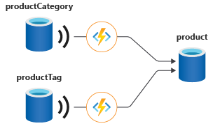

# Change Feed

A feature in Cosmos that update 1 container triggers another.

- Azure Cosmos DB has a feature called change feed that can manage referential integrity. Change feed is an API that lives within every Azure Cosmos DB container. Whenever you insert or update data to Azure Cosmos DB, change feed streams these changes to an API that you can listen to. 
- The bindings referenced here are only supported by all **EXCEPT** Table & Postgres



```C#
Container leaseContainer = client.GetContainer(databaseId, Program.leasesContainer);
Container monitoredContainer = client.GetContainer(databaseId, Program.monitoredContainer);
//notice is monitor writing to lease
ChangeFeedProcessor changeFeedProcessor = monitoredContainer
    .GetChangeFeedProcessorBuilder<ToDoItem>("changeFeedEstimator", Program.HandleChangesAsync)
        .WithInstanceName("consoleHost")
        .WithLeaseContainer(leaseContainer)
        .Build();
```

## Types of Change Feed
3 types of change feed
1. Azure Functions Trigger  (AzureCosmosDBTrigger)
2. Change Feed Processor (CFP)
3. Change Feed Pull Model

Change feed API is only specific for NoSQL CosmosDB. For all others need to use their native API.
| Cosmos DB API | Change Feed Support | Notes |
| -- | -- | -- |
| API for NoSQL | Full Support | Supports all consumption methods: Azure Functions Trigger, Change Feed Processor, and Pull Model. |
| API for MongoDB | Supported | Functionality is surfaced as Change Streams, which can be consumed using standard MongoDB drivers. |
| API for Cassandra | Supported | Functionality is surfaced as Change Feed with CQL query. |
| API for Gremlin | Supported | Change feed can be consumed using the Change Feed Processor or Pull Model. |
| API for Table | Not Supported | The change feed feature is not available for this API. |
| API for PostgreSQL | Not Supported | The change feed feature is not available for this API. |

## 1. The Low-Level Operation
At its core, ReadFeed is the name of the operation that an SDK or the REST API uses for:

- Listing all documents in a container: When you iterate over all items in a collection without a specific query, the underlying request is a ReadFeed on the documents resource (/dbs/{db-id}/colls/{coll-id}/docs).

- Listing all databases or containers: Retrieving the list of resources for administrative purposes.

- The Change Feed: The most important use of the ReadFeed mechanism is for the Change Feed.

## 2. The Link to the Change Feed
The Change Feed is the persistent, ordered log of changes that happen to items in a container. When you consume the Change Feed, your application is technically performing a specific type of ReadFeed operation.

The Azure Monitor metrics confirm this by having a specific metric type: Total Request Units - Operation Type ReadFeed. This metric tracks the RU cost of all operations that pull a list of resources or changes from the container.

## SDK for Change Feed
It's like an eventhub it always handles "at-least-once" and persisted. Must used the same same processorName (or the same leasePrefix). Note processorName can also be used for scalability, i.e. few application with 1 feed processor.

It uses persistent, append-only transaction log.  Unlike a typical message queue (like Event Hubs, which has a maximum retention period, usually 90 days), the Change Feed persists changes for the lifetime of the container. You can read from the very beginning of the container's history at any time.

```java
final String PROCESSOR_GROUP_NAME = "MyArchiveService_V1"; 

// 2. Create the Options object and set the leasePrefix
ChangeFeedProcessorOptions options = new ChangeFeedProcessorOptions();

// THIS is where you specify the processorName/leasePrefix
options.setLeasePrefix(PROCESSOR_GROUP_NAME); 
options.setStartFromBeginning(true); // Your existing option

ChangeFeedProcessor processor = new ChangeFeedProcessorBuilder()
    .hostName("MyChangeFeedWorkerInstance") // A unique ID for this app instance
    .feedContainer(monitoredContainer)     // The container holding your data
    .leaseContainer(leaseContainer)        // The container used for checkpointing/coordination
    .handleChanges(handleChanges())        // The delegate function defined above
    // Optional: Start from the beginning of the container
    .options(options) 
    .buildChangeFeedProcessor();
```

## Settings
Saved Lease (Highest Precedence): If the Lease Container already contains a document (a lease) for that partition with your configured leasePrefix (processorName), the CFP will ignore all startup options and resume exactly from the continuation token saved in that lease document. This ensures the "at-least-once" guarantee.

setStartContinuation(...): If you provide a specific continuation token, the CFP will start from that token. This option overrides setStartTime and setStartFromBeginning.

setStartTime(...): If you provide a specific UTC time, the CFP will start reading from the change log at that time. This option overrides setStartFromBeginning.

setStartFromBeginning(true) (Lowest Precedence): This option is only used as a default starting point if no lease, no continuation token, and no start time is specified. It tells the CFP to start reading from the container's creation time.

Default (setStartFromBeginning(false)): If you don't set any of the above options and there is no lease, the CFP starts reading changes generated from the moment the processor starts ("Now").

*NOTE*: 
leaseContainerName - is a special name for storing the change_feed reference/pointer.

## Change Estimator

Use to identify if your change feed solution needs to scale out can be difficult and requires an estimator feature. The change feed estimator is a sidecar feature to the processor that measures the number of changes that are pending to be read by the processor at any point in time. Think of it as a progressbar.

```C#
ChangeFeedProcessor estimator = sourceContainer.GetChangeFeedEstimatorBuilder(
    processorName: "productItemEstimator",
    estimationDelegate: changeEstimationDelegate) // ChangeEstimator
    .WithLeaseContainer(leaseContainer)
    .Build();
```

Estimator is builder is tied to lease container hence it can be rebuild with
```C#
ChangeFeedEstimator changeFeedEstimator = monitoredContainer
    .GetChangeFeedEstimator("changeFeedEstimator", leaseContainer);

Console.WriteLine("Checking estimation...");
using FeedIterator<ChangeFeedProcessorState> estimatorIterator = changeFeedEstimator.GetCurrentStateIterator();
while (estimatorIterator.HasMoreResults)
{
    FeedResponse<ChangeFeedProcessorState> states = await estimatorIterator.ReadNextAsync();
    foreach (ChangeFeedProcessorState leaseState in states)
    {
        string host = leaseState.InstanceName == null ? $"not owned by any host currently" : $"owned by host {leaseState.InstanceName}";
        Console.WriteLine($"Lease [{leaseState.LeaseToken}] {host} reports {leaseState.EstimatedLag} as estimated lag.");
    }
}
```

## Multi-region write
For [multi-region write](https://learn.microsoft.com/en-us/azure/cosmos-db/multi-region-writes) accounts, there are two timestamps:
1. The server epoch time at which the record was written in the local region. This is recorded as `_ts`.
2. The epoch time at which the absence of a conflict was confirmed, or the conflict was resolved. This is recorded as `crts`.

Change feed items come in the order recorded by `crts`.

## Change Feed Mode

There are 2 feed modes
- **Latest version mode** (aka INCREMENTAL) - you see the latest change from an insert or update for all items in the feed, and the feed is available for the life of the container. There's no indication whether a given change is from an insert or an update operation, and deletes aren't captured. Changes can be read from any point in time as far back as the origin of your container. _However, if an item is deleted, it's removed from the change feed history but not in lease container._
- **All versions and deletes mode** (aka FULLFIDELITY) - MUST have Continuous backup. All versions and deletes mode allows you to see all changes to items from creates, updates, and deletes. You get a record of each change to items in the order that it occurred, including intermediate changes to an item between change feed reads. It displays only until continuous backup data.

**NOTE**: 
- Deleted are not tracked, only way is to have either delete mode (but must be within window of backup) OR use soft delete.
- SDK only receive all properties of updated/inserted item, there are no original property value. I.e. if only age is updated, then the value received are age, name, _ts.

### Difference between Change Feed Processor(Push) and Change Feed Iterator (Pull) Model

- Pull is local and based on partition key.
- Pull has chances of duplicates, so check for error 304.

| Feature | Change feed processor | Change feed pull model
| -- | -- | -- |
| Keeping track of the current point in processing the change feed | Lease (stored in an Azure Cosmos DB container) | Not necessary and developer can implement personal way of keeping pointer. | Continuation token (stored in memory or manually persisted) |
| Ability to replay past changes | Yes, with push model | Yes, with pull model |
| Polling for future changes | Automatically checks for changes based on user-specified WithPollInterval value | Manual with continuation token |
| Behavior when there are no new changes | Automatically wait the value for WithPollInterval and then recheck | Must check status and manually recheck |
| Process changes from an entire container | Yes, and automatically parallelized across multiple threads and machines that consume from the same container | Yes, and manually parallelized by using FeedRange |
| Process changes from only a single partition key | Not supported | Optional, This feature is only available for Beginning, Time and Now. Using continousToken there is no partition key monitoring. |
| Class | Use ChangeFeedProcessor | Use ChangeFeedIterator `FeedIterator<User> InteratorWithPOCOS = container.GetChangeFeedIterator<User>(ChangeFeedStartFrom.Beginning(), ChangeFeedMode.LatestVersion);` |

## Using Spark

Consider use Spark if Change Feed is slow.

- Large-scale data processing: When you need to process high volumes of change feed data that exceed single-machine capabilities
- Complex transformations: When your change feed processing involves complex data transformations, aggregations, or joins with other datasets
- Distributed analytics: When you need to perform real-time or near-real-time analytics on change feed data across a distributed environment
- Integration with data pipelines: When change feed processing is part of larger ETL/ELT pipelines that already use Spark
- Fault tolerance requirements: When you need robust checkpointing and recovery mechanisms for production workloads
- Multi-container processing: When you need to process change feeds from multiple containers simultaneously

## Scaling / Distribution

Wthin a deployment unit, you can have one or more compute instances. To take advantage of the compute distribution within the deployment unit, the only key requirements are that:
1. All instances should have the **same** lease container configuration.
2. All instances should have the **same** value for **processorName**.
3. Each instance needs to have a **different** instance name (**WithInstanceName**).

Processor is consumer group (like Kafka, it is the controller group name). Instance is physical/logical compute instance.

Analogy: Imagine the Cosmos DB Change Feed is a large book (the data).
-The Processor Name is the title of the book—everyone reading the same book works on the same job.
-The Lease Container is the tracking sheet that breaks the book into chapters (leases) and shows which person is reading which chapter.
-The Instance is a single person.
-The Instance Name is the person's unique name—it's how the tracking sheet knows who to assign a chapter to.

## Lease Container
It's a container and need to be created manually or if with SDK can be created withLeaseIfNotExist (remember the later can only be created using master key, using Service Principal/Managed Identity will fail as SDK is data level only, not control plane). Default name is _leases_.

## What is a lease container used for?

It is a coordinator and it's function:
1. Distribute Work (Leasing): Coordinate and maintain which instance get which partition to handle. **Ensuring that only one consumer instance** processes the changes for a given partition range at any time
2. Maintain State (Checkpointing): Most important, as it acts as a **checkpoint store**. This table stores continuation token.
3. Enable Scalability and Failover: If a container instance die it coordinates and distributes to available instance.

This is what stored

Property | Description | Purpose
-- | -- | --
id | The unique identifier for the lease, often a combination of the processor name and the partition range ID. | Used as the partition key (/id is recommended) and for unique identification.
LeaseToken | The ID of the physical partition range this lease is for. | Maps the lease document to a specific physical shard of the monitored container.
ContinuationToken | The most important piece of data. This token is the bookmark that specifies the last processed location in the change feed for that partition. | Allows processing to resume exactly where it left off after a restart or failover.
Owner | A unique ID for the current consumer instance (host/worker) that holds the lease (e.g., the name of the Azure Function app instance). | Used for load balancing and determining ownership; only the owner can renew the lease.
Timestamp | The last time the lease was renewed. | Used by other hosts to determine if the current owner has failed (if the timestamp is too old).

## ChangeFeed mode

1. LatestVersion/Incremental - take the latest version. I.e. 2 updates on same record just takes the latest. (previously FullFidelity ) - (Old SDK includes delete), tracks all update and insert performed. CANNOT be used for periodic backup.
2. **All versions and deletes change feed mode** - This is a feature under settings. If need to track delete you need to enable this not the first incremental and latest only. Both 1. and 2. can monitor delete. It needs to be enabled in container after feature is enabled.

Feature | ChangeFeedMode.LatestVersion (Default) | ChangeFeedMode.Incremental
-- | -- | --
Data Returned | Returns the latest state of the document after the operation, even for intermediate updates. | Returns a detailed change record for every individual operation that occurred (Insert, Replace, Delete).
Update Reporting | If a document is updated 5 times between your polling checks, you will only see 1 document in the feed, showing its final state (the 5th update). | If a document is updated 5 times, you will receive 5 separate change records, one for each transaction.
Deletion Reporting | Deletions are not captured by default. They require the Full-Fidelity mode. | Deletions are not captured by default. They require the Full-Fidelity mode.
Efficiency | More efficient and smaller payload, as it aggregates rapid updates. | Less efficient due to higher volume of data, but provides a complete transaction history.
Use Case | Most common use case: synchronization, materializing views, or simple data processing where you only care about the final result. | Audit logging, complex state machines, or scenarios requiring every intermediate document version.

### The Rule: Periodic Backup &amp; "All versions and deletes"
Backup Mode | Change Feed Mode | Retention for Reprocessing | Captures Deletes?
-- | -- | -- | --
Periodic (Default) | Latest Version Mode (Only option) | Unlimited (for current documents) | NO (Deletes are not logged)
Continuous (Point-in-Time) | All Versions and Deletes Mode | Limited (Tied to backup retention, 7-30 days) | YES (Full history)

### Change feed retention

The retention period on the Azure Cosmos DB Change Feed in the "All versions and deletes" mode is not unlimited; it is tied directly to your account's Continuous Backup retention period. It can only be either before 7 days or after 30 days, if you reset your lease and reprocess, you can get it either <=7 days or <=30 days.

### Change Feed Retention in "All Versions and Deletes" Mode

The "All versions and deletes" change feed mode provides a complete log of creates, updates, and deletes (including those from TTL expiration), enabling full fidelity event sourcing.

Retention Period: Changes are retained only for the duration configured in your Azure Cosmos DB account's Continuous Backup policy.

Typical Period: The minimum continuous backup retention is 7 days, meaning your change feed will typically only retain events for the last 7 days. However, this can be extended up to 30 days.

## Lease prefix

If you have 4 physical partitions and 1 tenant is hogging 90% of the traffic, the "Lease Prefix" solves it like this:

Multiple Lease Sets: The leaseContainer will now have two sets of documents: Processor_Tenant_A_partition0 and Processor_Tenant_B_partition0.

Independent Workers: You can now have one instance of your app (Worker 1) focused entirely on the Processor_Tenant_A prefix.

Parallel Processing: Even though the data is on the same physical partition, because you have two different lease prefixes, two different threads can read from that partition simultaneously.

When to use this vs. the Azure Function Trigger
If you are using the [CosmosDBTrigger] attribute in an Azure Function, you are limited because the LeaseContainerPrefix is an attribute property and must be a constant.

```C#

// This is the standard way, but it is hard to make dynamic per-tenant
[FunctionName("ProcessData")]
public static void Run([CosmosDBTrigger(
    databaseName: "DatabaseId",
    containerName: "Orders",
    Connection = "CosmosDBConnection",
    LeaseContainerName = "leases",
    LeaseContainerPrefix = "GlobalPrefix")] // <--- Hardcoded
    IReadOnlyList<Order> input, ILogger log)
{
    // Processing logic
}
```

To solve the skew in Azure Functions specifically, you would:

1. Deploy the same Function App twice with different environment variables for the LeaseContainerPrefix.
2. Use a manual logic inside the code to ignore data that doesn't belong to that specific tenant (though this is less efficient than the SDK approach above).

## Tips

If exam says "Change Data Capture". I means to use either Azure Data Factory or Azure Synapse Analytics , but check if there are No SDK keyword. These are not SDK but another service/application.

Easily mistaken as change feed.

## Notes
1. Conflict feed is totally another thing. Do not get confused or mixed up.
2. leasePrefix = processor name.
3. Ttl update change are recorded in change feed.