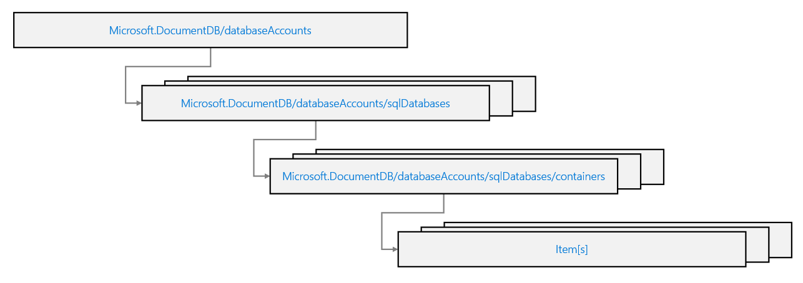

# Developer Tools

# Using template - Bicep / ARM



https://learn.microsoft.com/en-us/training/modules/create-resource-template-for-azure-cosmos-db-sql-api/7-exercise-create-container-using-azure-resource-manager-templates

```
az deployment group create --resource-group '<resource-group>' --template-file '.\template.json|bicep' --name 'jsontemplatedeploy'
```

**Throughput cannot be updated** by using templates. Since the process is running inside a pipeline, using the Azure portal is not an option and have to use CLI. (This is NO LONGER TRUE)

But: The limitation applies only to migrating between Manual and Autoscale provisioning. Templating cannot do this as the 2 have different formatting. You can change the containerThroughput value all day long to scale it. But if you tried to swap this definition for an autoscaleSettings block, the deployment would fail because the underlying Azure Resource Manager API does not support that schema switch via the simple PUT operation that Bicep performs during deployment.


### Summary

| Tool Type | Manual ↔ Autoscale Migration | Scaling (within the same mode) | Reason |
| -- | -- | -- | -- |
| Azure Portal | Supported | Supported | Uses dedicated API action (POST or migrate). |
| Azure CLI / PowerShell | Supported | Supported | Uses dedicated cmdlets/commands to call the migration API. |
| Bicep / ARM Templates | Not Supported | Supported | Only designed for declarative updates (PUT); does not handle the specialized POST migration action. |

# SDK 

https://learn.microsoft.com/en-us/training/modules/use-azure-cosmos-db-sql-api-sdk/4-connect-to-online-account?pivots=csharp

- Only CosmosClient has keyword cosmos, the rest of the classes uses Container, Database etc.
- CosmosClient is a 3 argument class `new CosmosClient(accountEndpoint, credential, cosmosoption);`
- Coding practices
  - Use promise instead of code block `await client.CreateDatabaseIfNotExistsAsync("cosmicworks");` ~`client.CreateDatabaseIfNotExistsAsync("cosmicworks").Result;`~
  - Use iterator instead of LINQ, `container.GetItemLinqQueryable<T>().Where(i => i.categoryId == 2).ToFeedIterator<T>();` ~`container.GetItemLinqQueryable<T>().Where(i => i.categoryId == 2).ToList<T>();`~
- Use *MaxItemCount*, with -1 being all - make sure it cannot be > 4MB. Use as max result set in query.
- Use *MaxConcurrency*, with -1 being handled by SDK. Use as number of concurrent operations ran client side during parallel query execution.
- Use *MaxBufferItemCount*, with -1 being handled by SDK. Use as maximum number of items that are buffered client-side during a parallel query execution.

# SDK Code
`CosmosClient` = used for connectivity or manage database (control plane)

The other classes use in SDK, 

Class | Purpose | Examples of Methods
-- | -- | --
Container | Used to perform operations on a specific container, including item (document) operations and querying. It is obtained from the CosmosClient via the Database object. | CreateItemAsync, ReadItemAsync, UpsertItemAsync, DeleteItemAsync, GetItemQueryIterator
ItemRequestOptions | A class that allows you to specify additional options for item operations, such as optimistic concurrency via ETag checks. | N/A (It's a configuration object)
QueryDefinition | Used to define the SQL query text and optionally provide parameterized values. | N/A (It's a definition object)
FeedIterator<T> | The object used to asynchronously retrieve results from a query (like a cursor or enumerator). | HasMoreResults, ReadNextAsync

## Food for thought.

You plan to use an Azure DevOps pipeline to deploy multiple Azure Cosmos DB for NoSQL databases and implement custom role-based access control (RBAC) roles for authorization.

Scenario:
After the deployment, you need to temporarily update the throughput to support a data migration process that requires increased performance.

Requirement:
You must determine the most efficient and flexible method to update the throughput dynamically.

This scenario: CLI is better suited as it's faster while using ARM/Bicep requires a full resource reconfiguration which is a bad approach (e.g. deploy every thing with 1000 throughput, then redeploy with 400 throughput but it needs to re-iterate everything).

## SDK Logging

Created using with **RequestHandler** and add AddCustomHandlers(new LogHandler());

```c#
public class LogHandler : RequestHandler
{    
    public override async Task<ResponseMessage> SendAsync(RequestMessage request, CancellationToken cancellationToken)
    {
        Console.WriteLine($"[{request.Method.Method}]\t{request.RequestUri}");

        ResponseMessage response = await base.SendAsync(request, cancellationToken);
        return response;
    }
}

CosmosClientBuilder builder = new CosmosClientBuilder()
    .endpoint("<your-cosmos-endpoint>")
    .credential(managedIdentityCredential)
    .consistencyLevel(ConsistencyLevel.EVENTUAL);

builder.AddCustomHandlers(new LogHandler());

CosmosClient client = builder.Build();
```

# SDK Update and delete

There are 3 types of patch/replace/upsert
- **PatchItemAsync** as your default for updates. It saves bandwidth and RUs, and prevents "clobbering" data if two users update different fields at the same time. A lil' bit low RU in sending less data.
- **ReplaceItemAsync** if you are using Optimistic Concurrency (ETags). While Patch supports it too, Replace is the traditional way to ensure "I am overwriting exactly what I last read.". High RU.
- **UpsertItemAsync** only when you are truly unsure if the data is already there. If you know you are creating a new record, CreateItemAsync is cheaper. Highest RU include query.

**NOTE**: Both requires a partition key.

## 1. Delete requires a partition key
```c#
string id = "027D0B9A-F9D9-4C96-8213-C8546C4AAE71";
string categoryId = "26C74104-40BC-4541-8EF5-9892F7F03D72";
PartitionKey partitionKey = new (categoryId);
await container.DeleteItemAsync<Product>(id, partitionKey);
```

## 2. Update sample requires a partition key
```c#
...
saddle.price = 35.00d;
await container.ReplaceItemAsync<Product>(saddle);
```

## 3. Delete all by partition key
This is disabled by default and require Azure support. It's efficient and run in background.
```#
await container.DeleteAllItemsByPartitionKeyStreamAsync(partitionKey);
```

## 4. Optimistic concurrency
IAzure Cosmos DB provides optimistic concurrency control (OCC) using ETags, which is a built-in feature across all its SDKs. 

```c#
ItemRequestOptions requestOptions = new ItemRequestOptions
        {
            IfMatchEtag = etag
        };

        // 4. Attempt to replace the item
        ItemResponse<Product> replaceResponse = await container.ReplaceItemAsync(
            itemToUpdate, 
            id, 
            new PartitionKey(partitionKey), 
            requestOptions
        );
```

## 5. Partial update
A single query with patch of different updates. Need to use patch. See that patch have different methods
```
List<PatchOperation> operations = new List<PatchOperation>()
{
    PatchOperation.Add("/status", "processed"),
    PatchOperation.Replace("/lastModified", DateTime.UtcNow),
    PatchOperation.Increment("/orderCount", 1)
};

// 3. Execute the Patch (Notice both ID and PartitionKey are required)
ItemResponse<dynamic> response = await container.PatchItemAsync<dynamic>(
    id: itemId,
    partitionKey: new PartitionKey(deviceType),
    patchOperations: operations
);
```

# Adding Log into Custom Handler for SDK

How to override an SDK, it's to add or override via RequestHandler.

```c#
builder.AddCustomHandlers(new LogHandler());

public class LogHandler : RequestHandler
{    
    public override async Task<ResponseMessage> SendAsync(RequestMessage request, CancellationToken cancellationToken)
    {
        Console.WriteLine($"[{request.Method.Method}]\t{request.RequestUri}");
        ResponseMessage response = await base.SendAsync(request, cancellationToken);
        Console.WriteLine($"[{Convert.ToInt32(response.StatusCode)}]\t{response.StatusCode}");
        return response;
    }
}
```

# Using Bicep / ARM

To use just take note of keywords
- dependsOn
- parent
https://learn.microsoft.com/en-sg/training/modules/create-resource-template-for-azure-cosmos-db-sql-api/4-configure-database-container-resources
- name is tricky, in template you define only the name. But if you have resource to update e.g. the indexPolicy you need to set to the properties.resource.indexingPolicy property of the "databaseAccounts/sqlDatabases/containers". I.e.   "name": "[concat('csmsarm', uniqueString(resourceGroup().id), '/cosmicworks/products')]",
https://learn.microsoft.com/en-sg/training/modules/create-resource-template-for-azure-cosmos-db-sql-api/6-manage-index-policies

## Commands on CLI

Remember there is only "Create", wether you create or update it is just create.

```bash
az deployment group create \
    --resource-group '<resource-group>' \
    --template-file '.\template.json'
```

# ARM JSON Template

Take note the naming of the resource is `csmsamr-<resource-group-id>/cosmicworks/products`
Take note of ARM template throughput, if manual you don't have a subset.
- properties.options.throughput
- properties.options.autoscaleSettings.maxThroughput

```json
{
  "$schema": "https://schema.management.azure.com/schemas/2019-04-01/deploymentTemplate.json#",
  "contentVersion": "1.0.0.0",
  "resources": [
    {
      "type": "Microsoft.DocumentDB/databaseAccounts",
      "apiVersion": "2024-04-15",
      "name": "[concat('csmsarm', uniqueString(resourceGroup().id))]",
      "location": "[resourceGroup().location]",
      "properties": {
        "databaseAccountOfferType": "Standard",
        "locations": [
          {
            "locationName": "westus"
          }
        ]
      }
    },
    {
      "type": "Microsoft.DocumentDB/databaseAccounts/sqlDatabases",
      "apiVersion": "2024-04-15",
      "name": "[concat('csmsarm', uniqueString(resourceGroup().id), '/cosmicworks')]",
      "dependsOn": [
        "[resourceId('Microsoft.DocumentDB/databaseAccounts', concat('csmsarm', uniqueString(resourceGroup().id)))]"
      ],
      "properties": {
        "resource": {
          "id": "cosmicworks"
        }
      }
    },
    {
      "type": "Microsoft.DocumentDB/databaseAccounts/sqlDatabases/containers",
      "apiVersion": "2021-05-15",
      "name": "[concat('csmsarm', uniqueString(resourceGroup().id), '/cosmicworks/products')]",
      "dependsOn": [
        "[resourceId('Microsoft.DocumentDB/databaseAccounts', concat('csmsarm', uniqueString(resourceGroup().id)))]",
        "[resourceId('Microsoft.DocumentDB/databaseAccounts/sqlDatabases', concat('csmsarm', uniqueString(resourceGroup().id)), 'cosmicworks')]"
      ],
      "properties": {
        "resource": {
          "id": "products",
          "partitionKey": {
            "paths": [
              "/categoryId"
            ]
          },
          "indexingPolicy": {
            "indexingMode": "consistent",
            "automatic": true,
            "includedPaths": [
              {
                "path": "/price/*"
              }
            ],
            "excludedPaths": [
              {
                "path": "/*"
              }
            ]
          }
        },
        "options": {
          "autoscaleSettings": {
            "maxThroughput": 1000
          },
        }
      }
    }
  ]
}
```