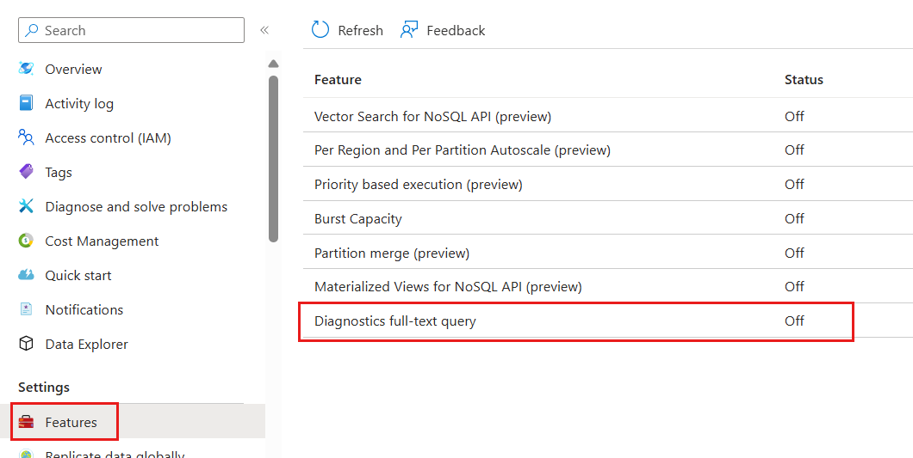

# Feature and Implementations

To prevent 429 (Rate limiting) or 502 (Timeout) there are other implementations:

## Queue-based load
- For insert/update (not so for query but possible if async)
- Adding queue architecture to process data 1 by 1.

## Materialized View pattern
- https://learn.microsoft.com/en-us/azure/architecture/patterns/materialized-view
- Create a *View* like db, A key point is that a materialized view and the data it contains is completely disposable because it can be entirely rebuilt from the source data stores. A materialized view is never updated directly by an application, and so it's a specialized cache.
- Steps: 
1. Enable on Account: Enable the Materialized Views feature in the Azure Portal (Features blade).
2. Create Builder: You must configure a Materialized View Builder resource, which is the compute dedicated to automatically keeping the view up-to-date using the change feed.
3. Define View: Define the view, specifying the SourceContainer, the TargetContainer, and the SELECT query that defines the view's content and new partition key.



## Features

### Burst Capacity

| Function | Explanation |
| -- | -- |
| What it is | A mechanism that allows your database or container to temporarily consume unused, idle Request Units (RU/s) capacity to handle sudden, short-lived spikes in traffic. |
| How it works | When your provisioned throughput partition is idle (not fully utilizing its RU/s), it accumulates "burst capacity" credits for up to five minutes. During a sudden spike, requests that would normally be rate-limited (429 errors) are instead served using this banked capacity at a maximum rate (typically up to 3000 RU/s per physical partition). |
| Why it's useful | It helps maintain low latency and avoid throttling during unexpected traffic peaks without requiring you to over-provision RU/s for your average workload, saving costs. |

### Materialized View

| Function | Explanation |
| -- | -- |
| What it is | A materialized view is a secondary, pre-computed container (or "view") that stores the results of a query run against your primary data container (the base container). |
| How it works | When you write data to the base container, the materialized view is automatically updated in the background. It allows you to transform and project your data into a different structure, often with a different partition key, that is optimized specifically for a common read query.
| Why it's useful | It enables server-side denormalization. If your data is partitioned for efficient writes (e.g., by CustomerID), but you frequently run read queries optimized for a different key (e.g., by ProductCategory), a materialized view lets you execute that read query very quickly and efficiently without having to perform costly cross-partition queries on the base data. |

### Partition Merge

| Function | Explanation |
| -- | -- |
| What it is | A capability to reduce the number of physical partitions in your container by combining fragmented partitions. |
| How it works | When a container initially scales up due to high storage or throughput needs, it splits partitions. If storage is later deleted or throughput is scaled down, you can be left with "fragmented" containers—many partitions with very little  || RU/s or storage each. Partition merge combines these smaller partitions back into fewer, larger ones. |
| Why it's useful | It optimizes cost and performance. By consolidating RU/s onto fewer partitions, each partition gets a larger share of the overall provisioned RU/s, which helps prevent rate-limiting and improves query efficiency. |

### Priority Based Execution

| Function | Explanation |
| -- | -- |
| What it is | A feature that allows you to tag requests sent to the database with a priority level (currently "High" or "Low"). |
| How it works | When the total requests exceed the provisioned RU/s capacity, Azure Cosmos DB will preferentially throttle (return 429) the Low Priority requests first, allowing the High Priority requests to execute successfully. Low-priority requests are retried later by the SDK. |
| Why it's useful | It ensures mission-critical operations (like customer checkouts or login requests) are always executed immediately, while less critical background tasks (like data migration, reporting, or batch updates) are delayed during peak load, optimizing the user experience without requiring you to over-provision. |

| Feature | Primary Goal | Azure Portal Action (Control Plane) | SDK Action (Data Plane) |
| -- | -- | -- | -- |
| Burst Capacity (Temporary RU) | Temporarily exceed provisioned RU/s for short, high-traffic periods. | Enable it on the Cosmos DB Account level (usually in the Features blade). | None required. The feature is automatic and transparent to the SDK. |
| Priority-based Execution (Low Priority Throttling) | Ensure critical requests succeed by throttling non-critical requests first under heavy load. | Enable it on the Cosmos DB Account level (Features blade). | Mandatory: Set the PriorityLevel to Low or High in the request options for specific SDK operations. |
| Materialized Views | Optimize expensive cross-partition queries (e.g., aggregation, filtering by a non-partition key). | 1. Enable the feature on the account. 2. Create the Materialized View Builder. 3. Define the Materialized View (source container, target container, SQL query). | Query the Target Container. Instead of querying the expensive source container, your application queries the target Materialized View container. |
| Partition Merge | Reduce the RU/s requirement and cost of a container by combining physical partitions that are underutilized. | Enable the feature on the account (Features blade). | None required to start the merge. The merge operation is triggered via Azure CLI or PowerShell. You must only ensure your SDK version is compatible while the merge is running. |
| All versions and deletes change feed mode | To capture change feed on delete | Enable on portal then on the container. This is only available after 2024-12 any account before require to contact support. | It's a setting to enable in container |

## Settings example
E.g

```C#
var highPriorityOptions = new ItemRequestOptions 
{ 
    PriorityLevel = PriorityLevel.High 
};

// This read is prioritized when RU/s are consumed
ItemResponse<Product> highPriorityResponse = await container.ReadItemAsync<Product>(
    "itemId", 
    new PartitionKey("partitionKey"), 
    highPriorityOptions
);
```

```bash
# 1. Install the Azure Cosmos DB preview extension (if you haven't already)
az extension add --name cosmosdb-preview

# 2. Run the merge command
az cosmosdb sql container merge \
  --resource-group <resource-group-name> \
  --account-name <cosmos-account-name> \
  --database-name <database-name> \
  --name <container-name> \
  --throughput-split-percentage <percentage-to-retain>

## throughput-split-percentage - optional, give distributed throughput per partition
```

**Eligibility**: Ensure your account is eligible for the preview feature (single-write region, not using features like Point-in-Time Restore or Analytical Store).
**SDK Requirements**: Update your application's SDK to the minimum required version (e.g., .NET v3 SDK version 3.27.0 or higher) before running the merge.
**The Merge is Asynchronous**: Once you run the command, the merge process happens in the background and can take several hours depending on the amount of data. Your container remains online and available during this time.
**Monitor**: You should monitor the merge operation status in the Azure Portal under the container's settings or using CLI/PowerShell commands.


```mongo
// --- Command to Create/Update the Materialized View ---
// This aggregation pipeline groups data and uses $merge to save the results.
// NOTE: It is recommended to wrap this logic in a server-side function
// or scheduled job (like an Atlas Trigger or cron job) for automated refreshing.

db.sales.aggregate([
    // 1. Group documents by the year and month to get the summary key
    {
        $group: {
            // Create a unique key for the monthly summary document
            _id: {
                year: { $year: "$date" },
                month: { $month: "$date" }
            },
            totalRevenue: { $sum: "$amount" },
            orderCount: { $sum: 1 }
        }
    },

    // 2. Add a readable field for querying/display
    {
        $addFields: {
            month_key: {
                $dateToString: {
                    format: "%Y-%m",
                    date: {
                        $dateFromParts: {
                            'year': "$_id.year",
                            'month': "$_id.month"
                        }
                    }
                }
            }
        }
    },
    
    // 3. The Materialization Step: Use $merge to write the results
    {
        $merge: {
            into: "monthly_sales_summary", // The collection that acts as the Materialized View
            on: "month_key",               // The field to match on (acts as the primary key of the view)
            whenMatched: "replace",        // Action if a document with the same month_key exists
            whenNotMatched: "insert"       // Action if no document matches
        }
    }
]);
```

## Design patterns
https://github.com/Azure-Samples/cosmos-db-design-patterns

## Full Text Search

Is a capability for elastic search capabilities. It support locales (optional) and currently DOES NOT support Wild card characters (*, [])
```
   "fullTextPaths": [
       {
           "path": "/text1",
           "language": "en-US"
       },
       {
           "path": "/text2"
       }
   ]
```
