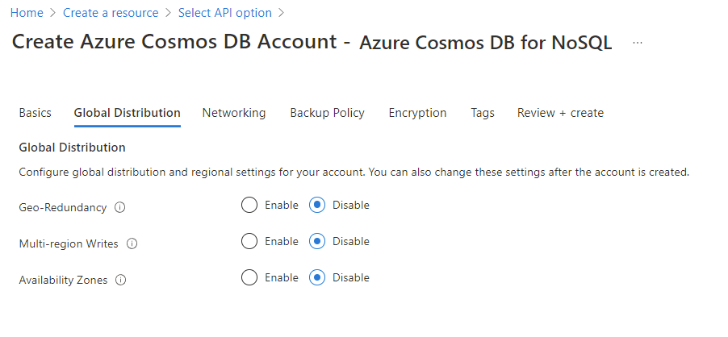
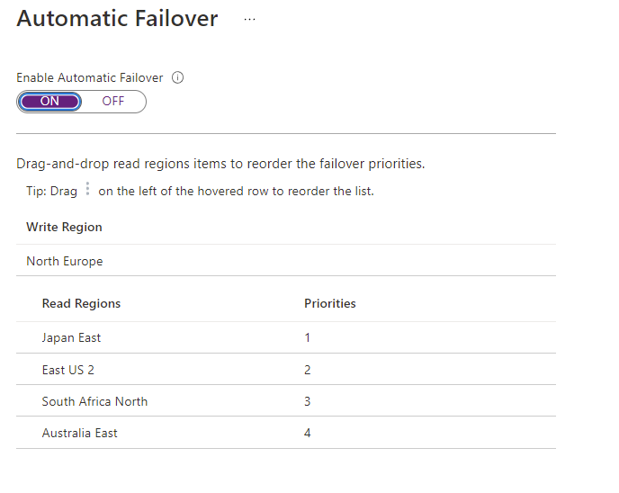
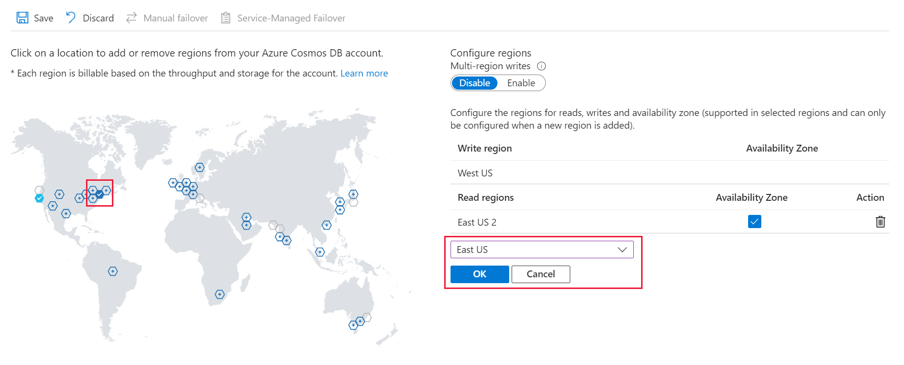
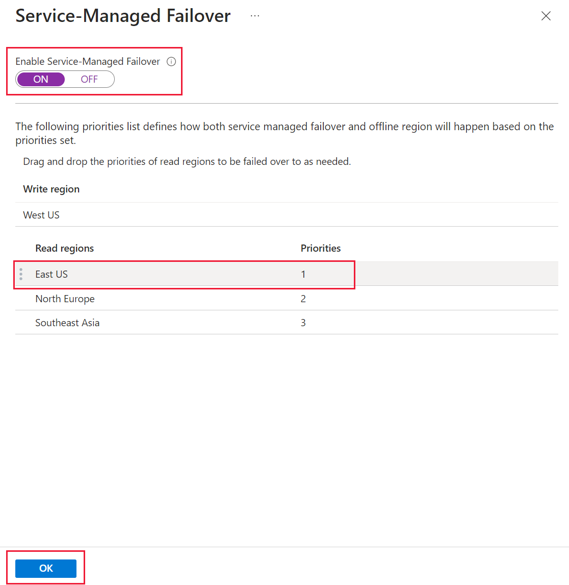
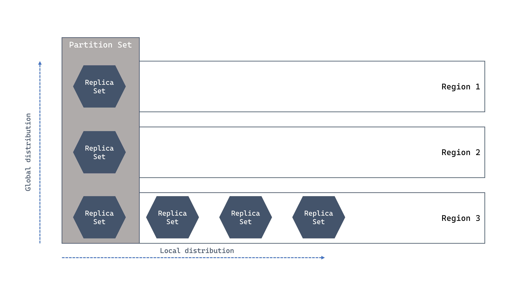

# Replication

## Global Distribution
1. Geo redundancy - only on paired region not global world (can choose region replication/different). Enable global distribution on your account by pairing West US 2 with West Central US. You can add more regions to your account later.
2. Multi region write - multi write and read region, number of read = number of write region, it's paired.
3. Availability Zone - replicate / auto balance (take note not all region have AZ, i.e. Sweden)
4. The following options aren't available if you select Serverless as the Capacity mode:
    - Multi-region write
    - Periodic backup
    - Multi-region (not GRS)



## RU Cost
RU is costly for replication. Each region need to be accounted for RU. For standard provisioned throughput, the core formula is RU/s x # of regions. 

Example of 5 regions...+1 is because the main 1 is considered.

```
1,000 x (1+5) = 6,000
```

Autoscale benefits here as if per-region, some region that did not consumer large amount of RU, it can be charged less.

## Auto failover
1. By default, automatic failover is not enabled for an Azure Cosmos DB account. Automatic failover must be enabled before defining a plan. Once enabled, the read regions can then be sorted by order of failover priority. After sorting, the new priority list can then be persisted and applied to the account.
2. doesn’t need to be in sequence, 0 is active write location.
3.  If auto failover, the write location cannot be changed. Azure needs a stable region. All the other priorities can change.
4.  Once failover happens, it updates in background and old write region remains as secondary.

Read region setting (priority), no write region if die dies.


Write region

| Region | Priority |
| --- | --- |
| West US 2 | 	(N/A - write region) |
| East US	| 1 |
| UK South	| 2 |

## Failovers
1. Manual failover is like automatic failover setup, just have a checkbox "agree". Same to choose either read/write failover.
2. The Azure Cosmos DB account must be configured with **multiple regions** for change-write region operation.
3. If you perform a manual change-write region operation while an asynchronous throughput scaling operation is in progress, the throughput scale-up operation is paused. It resumes automatically when the failover operation is complete. 
4. In the event of a write region outage, don't use change-write region. For outage scenarios, use forced failover.
5. **Choose either Service OR Manual**: You can't modify the write region (failover priority of zero) when the account is configured for service-managed failover. To change the write region, you must disable service-managed failover and do a manual failover.
6. The Wait Time: Failover is not instantaneous. The service must detect the outage and confirm it is a regional failure. This typically takes up to 1 hour (though Microsoft often completes it much faster) for a service-managed failover.
- READ region is automatically promoted as write region (if single write region is configured.) Backup will switch to the new read region but usually won't be a problem as Periodic backup will switch depending on selection.

## ApplicationRegion and ApplicationPreferredRegion

Code, there are difference between **ApplicationRegion** vs **ApplicationPreferredRegion**
Take note SDK do not check latency if using PreferredRegion (newer SDK do attempt to write parallel to nearest region).

```C#
// Define the preferred application region
CosmosClientOptions options = new()
{
    ApplicationRegion = "UK South"
};
```

or

```C#
CosmosClient client = new CosmosClientBuilder(accountEndpoint, credential)
    .WithApplicationPreferredRegions(new List<string>
    {
        Regions.EastAsia,
        Regions.SouthAfricaNorth,
        Regions.WestUS
    })
    .Build();
```

Take **note**:
1. For each application region, the team would like the .NET client app to select a specific region for read/write operations, and then have the SDK determine fallback regions based on their proximity to the selection. We only set ApplicationRegion so that we can set the location to write/read but if there are **no preference it will be based on proximity.**
2. If you do not specify a preferred region, the SDK will automatically default to the primary region for your account. The primary region is the first region in the region list, and is typically the region you selected first when you created the Azure Cosmos DB account. 
3. If there are multi-write and multi-read region at account level setting, setting WithApplicationPreferredRegions will override account and change *both* read/write base on the SDK list. If there is only single write (it will only use the account) and ignore SDK list on write and only on account level.
4. ApplicationPreferredRegions and ApplicationRegion cannot both be set.
5. Any region in your SDK list that does not exist in the account metadata is simply ignored. No exception is thrown. E.g. account level has only UK and East US, but SDK defines West US in the preferred list...West US is ignored and only UK and East US is used.
6. What happens if the entire list is invalid?
If none of the regions you provided in ApplicationPreferredRegions exist in the account (or if they are all misspelled), the SDK follows a fail-safe path:
  - Fallback to Primary: It will default to the Primary (Write) Region of the account.
  - Read Availability: For read operations, if the primary is also not in your list, it will simply use whatever regions are available in the account to ensure the application doesn't crash

## Conflicts Handling
See conflict handling.

**NOTE**: You can only set a conflict resolution policy on newly created 

Screenshot of how to configure region


There is Service Failover



## Clarification

Question what 
- is automatic failover equivalent to service failover - YES. If Enable Multi-Region Writes: ON then this service is disabled.
- What is this "When a new region is added, all data must be fully replicated and committed into the new region before the region is marked as available. The amount of time this operation takes depends upon how much data is stored within the account. If an [asynchronous throughput scaling operation](https://learn.microsoft.com/en-us/azure/cosmos-db/scaling-provisioned-throughput-best-practices#background-on-scaling-rus) is in progress, the throughput scale-up operation is paused and resumes automatically when the add/remove region operation is complete. Additionally, when removing an existing region, all replication across regions (within [partition sets](https://learn.microsoft.com/en-us/azure/cosmos-db/global-dist-under-the-hood)) must complete before the region is marked as unavailable."

## Switching region has health checks. 
These are the basic conditions.
- If replication from 1 region to the other is not complete it will fail. E.g. from single to multi it has to be completed before write region can be switched over
- The region is healthy to allow switching to priority=0

## Failover via Azure CLI
This script 'update' is nice, it allows to 
- Add when you add --location
- Remove when you ignore --location

```
az cosmosdb update -n $accountName -g $resourceGroupName \
--locations regionName='West Europe' failoverPriority=0 isZoneRedundant-False \
--locations regionName='Nort Europe' failoverPriority=1 isZoneRedundant-False
```

To enable multi-write just put
```
... --enable-multiple-write-locations true
//code is useMultipleWriteLocations
```
Caveat in write
- cannot select write region
- has to have at least 2 region
- NO Strong consistency

## Exam tricky questions

### Example 1
You are deploying App1 to a workstation in San Francisco.
You need to make the Azure Cosmos DB client aware of multi region writes and select the closest Azure region.

In this question you should deploy as there are no such thing as policy.SetCurrentLocation("San Francisco")
```C#
ConnectionPolicy policy = new ConnectionPolicy
    {
        ConnectionMode = ConnectionMode.Direct,
        ConnectionProtocol = Protocol.Tcp,
        UseMultipleWriteLocations = true
    };
policy.SetCurrentLocation("West US"); //Question may sometime trick by putting "London", "San Francisco"
```

### Example2
1. The application team created a brand new Azure Cosmos DB account with a write region in West US and two read regions in UK South and Japan East. The team made no further configuration changes from the default configuration for a new account. There's a current data center outage in West US. What failover action does Azure Cosmos DB do?

- Fail over to UK South
- Nothing <-- This is the answer, because only write region is down and there are no failover but read still runs.
- Fail over to Japan East

## Food for thought
You can use Custom conflict policy with stored procedure that examines remoteRegionId and prioritise region.

## Debugging Latency and Region
1. You can check with metric using Replication Latency to know the replication delay time between 2 regions, e.g. delay takes bout 2ms to replicate between Central Asia to East US.
2. You can see the active region used in code with "Diagnostics"

```c#
 ItemResponse<dynamic> response = aawait container.ReadItemAsync<dynamic>(
     "7d9273d9-5d91-404c-bb2d-126abb6e4833",
     new PartitionKey("78d204a2-7d64-4f4a-ac29-9bfc437ae959")
 );

Console.WriteLine($"{response.Diagnostics}");
```

## Global vs Local Region replication

Just take note that local do replicates (zone redundant) as well. Zone redundant need to be specified with `isZoneRedundant=true`



## Dynamic Quorum

For a 5 region account, the majority is three, so up to 2 unresponsive regions can be removed. 
This capability is known as "dynamic quorum" and can improve both write availability and replication latency for accounts with three or more regions.

* When regions are removed from the quorum set as part of dynamic quorum, those regions are no longer able to serve reads until readded into the quorum.

# Read/Write of Consistency level
Write consistency is always based on account consistency level. It is regardless is multi region or single region write.

Example:
In cosmosdb if i have multiregion read consistency; given that i have a strong consistency at the db level and only a single write region, what happens to the write consistency if my application SDK is using eventual consistency?

Database-Level Strong Consistency (Strong): When your Cosmos DB account is configured for Strong consistency with a single write region, it means that every write must be synchronously replicated and committed to all configured regions before the write is acknowledged as complete to the client. This is the strongest possible guarantee for your data writes and durability.

Global Commitment: Because the account's default consistency is Strong, the write operation will synchronously replicate to all secondary read regions and be committed there before the write request returns success to your application.

Read Consistency: If your SDK client issues a read request with the Eventual consistency setting (which is weaker than the account's default Strong), that read will be executed against a single replica in the region being targeted, bypassing the requirement to consult other replicas.

## Gateway vs Direct mode

To use Gateway mode, client SDK is required to set ConsistencyLevel to either "Session" or "Eventual Consistency". It cannot even support Consistent Prefix which is the order of the write.

Code
```c#
CosmosClientOptions options = new ()
{
    ConnectionMode = ConnectionMode.Gateway //ConnectionMode.Direct
};

```