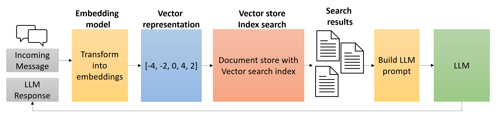

# Vector

https://learn.microsoft.com/en-us/azure/cosmos-db/gen-ai/why-cosmos-ai

Notes
- Requires 15 minutes to be enabled at account level.
- Only available in NoSQL CosmosDB.
- The vector search feature is currently not supported on the existing containers, so you need to create a new container and specify the container-level vector embedding policy and the vector indexing policy at the time of container creation.

```
az cosmosdb update \
 --resource-group <resource-group-name> \
 --name <cosmos-db-account-name> \
 --capabilities EnableNoSQLVectorSearch
```

Indexing Policy
```json
{
    "indexingMode": "consistent",
    "automatic": true,
    ...
    "vectorIndexes": [
        {
            "path": "/embedding",
            "type": "diskANN",
            "quantizationByteSize": 96,
            "indexingSearchListSize": 100
        }
    ]
}
```

**Supports vector search.** Focus on "index" DiskANN :

Vector search in Azure Cosmos DB is built on DiskANN, a graph-based indexing and search system that can index, store, and search large sets of vector data on relatively small amounts of computational resources. DiskANN stores highly compressed, vectors in memory, while storing the full vectors and graph structure in on-cluster, high-speed SSDs that constitute the backbone of Azure Cosmos DB data storage. DiskANN provides fast search, while maintaining accuracy under replaces and deletions. DiskANN also supports efficient query filtering via pushdown to the index to enable fast and cost-effective hybrid queries. DiskANN has been used successfully within Microsoft for years, and today it is part of crucial Microsoft applications such as web search, advertisements, and the Microsoft 365 and Windows copilot runtimes.

## Vector Types

| Type | Description | Max dimensions |
| -- | -- | -- |
| flat | Stores vectors on the same index as other indexed properties. | 505 |
| quantizedFlat | Quantizes (compresses) vectors before storing on the index. This policy can improve latency and throughput at the cost of a small amount of accuracy. | 4096 |
| diskANN | Creates an index based on DiskANN for fast and efficient approximate search. | 4096 |


Feature | Flat | QuantizedFlat | DiskANN
-- | -- | -- | --
Search Type | Exact (Brute-force) | Exact (on compressed data) | Approximate (Graph-based)
Accuracy (Recall) | 100% (Perfect) | ~99% (High) | ~95% - 99% (Tunable)
Speed | Slow (Linear) | Fast | Fastest (Logarithmic)
RAM Usage | Very High | Low | Lowest (Offloads to SSD)
Best For... | < 10k vectors | 10k – 50k vectors | 50k – Billions of vectors

## Vector Search

Executing vector searches with Azure Cosmos DB for NoSQL involves the following steps:
1. Create and store vector embeddings for the fields on which you want to perform similarity searches.
2. Specify the vector embedding paths in the container's vector embedding policy.
3. Include any desired vector indexes in the indexing policy for the container.
4. Populate the container with documents containing vector embeddings.
5. Generate embeddings representing the search query using Azure OpenAI or another service.
6. Run a query using the VectorDistance function to compare the similarity of the search query embeddings to those embeddings of the vectors stored in the Cosmos DB container.

