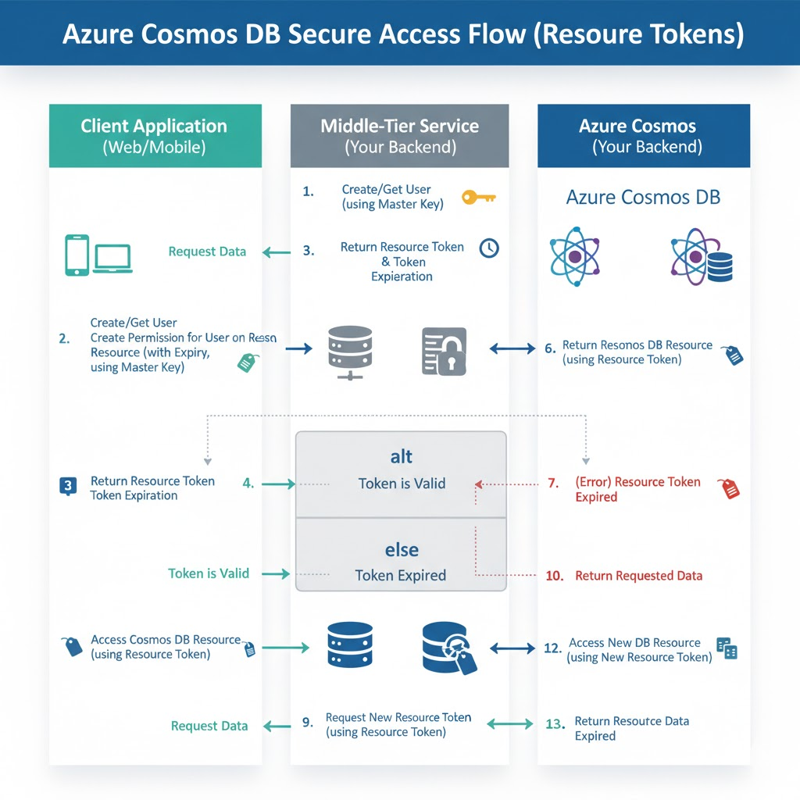

# Authentication

# Login methods

## Master Key
You have both primary/secondary and direct use of Key/password

## Resource token
1. This approach require you to create (via SDK/Code) a CosmosDB user and its complicated.
2. You still need master key if not not possible to create resource token/permission.
3. Big ISSUE, is this have no RBAC and without it the class "Permission", user can actually grant full access "Permission.ALL" as it uses masterkey. To prevent this, the resource token generator is best to be a middleware (another applicaiton), hence complicates things. But using resource token generator via a middleware you can custom control a) Authentication, b) time-based access.
4. It's Resource Token in SDK are short-lived (1 hour)

## Entra ID
You can use RBAC with this

```c#
var client = new CosmosClient(
    accountEndpoint: "your-account-endpoint",
    // The DefaultAzureCredential automatically finds the Managed Identity
    new DefaultAzureCredential() 
);
```

# Secure Resource Token.

To prevent user give full access need to implement a mid-tier service where user are not given master key but calls a service to retrieve master key. It's a pattern/architecture.

Since it's complex, resource token is not recommended.

_(Below is created using Gemini - to get a jist, not an accurate diagram)_



```c#
CosmosClient adminClient = new CosmosClient(
    accountEndpoint: "your-account-endpoint",
    authKeyOrResourceToken: "your-master-key" // WARNING: Keep this secure!
);


// Create the User
UserResponse userResponse = await adminClient.GetDatabase(databaseId)
    .CreateUserAsync(id: cosmosDbUserId);
User user = userResponse.User;

/*
try
    {
        // Try to read the existing User object. This is the reuse step.
        UserResponse userResponse = await adminClient.GetDatabase(databaseId)
            .GetUser(cosmosDbUserId)
            .ReadAsync();
        
        user = userResponse.User;
    }
*/

// Create a Permission for Read access to a specific container - MUST be called every time.
PermissionProperties permissionProperties = new PermissionProperties(
    id: "readPermissionForContainer",
    permissionMode: PermissionMode.Read,
    container: adminClient.GetContainer(databaseId, "myContainer")
);

// Create the Permission on the User
PermissionResponse permissionResponse = await user.CreatePermissionAsync(
    permissionProperties
);

//With this db user you then authenticate with
string resourceToken = permissionResponse.Resource.Token;
```

## Authentication for external access

- Azure Data Factory Pipeline $\rightarrow$ Managed Identity (Best for maintenance and security).
- GitHub/GitLab CI Pipeline $\rightarrow$ Service Principal (with OIDC) (Best for external access without managed secrets).

For Managed Identity/Service Principal - both can use RBAC. The difference between managed identity and SP is that it is granted access to without password/certificate to authenticate.

Managed identities are application-centric, not user-centric.

Steps
**Step 1:** Enable the Managed Identity on Azure Data Factory (ADF)You don't have to "create" the identity; you just enable it. The recommended type for your scenario is the System-Assigned Managed Identity.Go to your Azure Data Factory (ADF) resource in the Azure Portal.Navigate to the Managed Identities section (or Identity in newer portals).Set the System-Assigned status to On and save.Azure will automatically register this identity in Azure Active Directory (Azure AD). You'll get an Object ID (Principal ID). 

**Step 2:** Grant the Managed Identity Access to Cosmos DB (Azure RBAC)This step uses Azure Role-Based Access Control (Azure RBAC) to give the ADF's new identity the specific permissions it needs on the Cosmos DB account.Go to your Azure Cosmos DB account in the Azure Portal.Navigate to Access control (IAM).Click Add $\rightarrow$ Add role assignment.Select the desired role. For a pipeline that needs to write data, choose:Data Plane Access (Recommended): The built-in role Cosmos DB Built-in Data Contributor (or similar write access role). This grants only the necessary data access.On the Members tab:Set Assign access to to Managed identity.Select the Subscription your ADF is in.Select the Managed identity type as Data Factory.Find and select your specific Azure Data Factory instance (its name matches its system-assigned managed identity name).Complete the assignment.

**Step 3:** Configure the Linked Service in ADFNow you configure the connection in your ADF pipeline to use the identity, not a key.In Azure Data Factory Studio, create or edit a Linked Service for Azure Cosmos DB for NoSQL.Under Authentication type, select System Managed Identity (or Managed Identity).Enter the Cosmos DB Account Endpoint and Database name.The ADF runtime will now automatically use the system-assigned managed identity to authenticate using a token. You never entered a key or a secret. Minimal maintenance achieved!