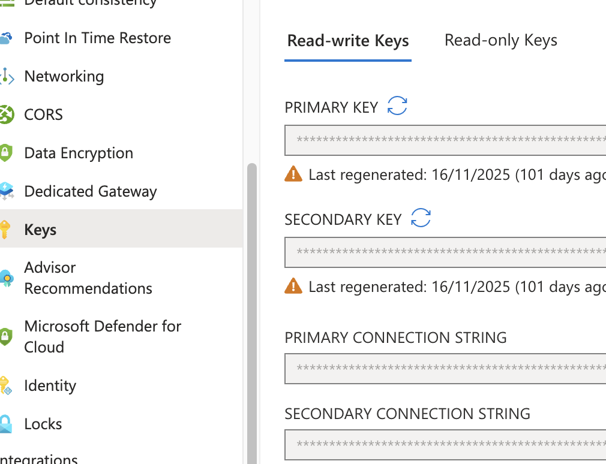

# Roles
RBAC stood for Role-Based Access Control.

## RBAC Roles

2 main RBAC roles:
- Azure RBAC aka. Control Plane Role
- CosmosDB RBAC aka. Data Plane Role

### Control Plane Role
The standard Access control (IAM) blade in the Azure portal for the Cosmos DB account.
What they control: Management of the resource itself (the "control plane"), such as:
- Creating or deleting the Cosmos DB account.
- Managing network settings, scaling, and backups.
- Listing or regenerating the primary/secondary account keys.

### Data Plane Role
Where you see them: They are NOT listed in the standard Access control (IAM) blade in the Azure portal.
What they control: Access to the data within the containers (the "data plane").
Examples of Roles (which you must use CLI for): Cosmos DB Built-in Data Contributor and Cosmos DB Built-in Data Reader

The only way to view Data Plane Roles:
```bash
_az cosmosdb sql role definition list \
    --account-name MyCosmosDBAccount \
    --resource-group MyResourceGroup_
```


| Feature | CDBDataPlaneRequests | CDBControlPlaneRequests |
| -- | -- | -- |
| Focus | Item data (CRUD, Queries) | Resource Management (Configuration) |
| Billing | Consumes Request Units (RUs) | Administrative (No RU cost) |
| Example | db.container.readItem(...) | az cosmosdb update --throughput 400 |
| Source | Application code / SDKs | Azure Portal, CLI, PowerShell, ARM Templates |

## Build int data reader role
- Take note 0001/Reader can read ChangeFeed
- Do one of the LAB and these role will make sense.


| ID | Name | Included actions |
| -- | -- | -- |
| 00000000-0000-0000-0000-000000000001 | Cosmos DB Built-in Data Reader | - Microsoft.DocumentDB/databaseAccounts/readMetadata - Microsoft.DocumentDB/databaseAccounts/sqlDatabases/containers/items/read -Microsoft.DocumentDB/databaseAccounts/sqlDatabases/containers/executeQuery - Microsoft.DocumentDB/databaseAccounts/sqlDatabases/containers/readChangeFeed |
| 00000000-0000-0000-0000-000000000002 | Cosmos DB Built-in Data Contributor | -Microsoft.DocumentDB/databaseAccounts/readMetadata - Microsoft.DocumentDB/databaseAccounts/sqlDatabases/containers/* - Microsoft.DocumentDB/databaseAccounts/sqlDatabases/containers/items/* |

## Disabling Master key login and only use RBAC 

- This disable master key, note there are 2 secrets which are primary/secondary key.


- **disableLocalAuth**, When using RBAC, you can disable the Azure Cosmos DB account primary and secondary key if you wish to use RBAC exclusively. Disabling the accounts can be done by setting the **disableLocalAuth** to true when creating or updating your Azure Cosmos DB account using Azure Resource Manager templates. Need to use data explorer with **feature.enableAadDataPlane**=true
- **disableKeyBasedMetadataWriteAccess**, When key-based metadata write access is disabled, clients connecting to the Azure Cosmos DB account through account keys are prevented from accessing the account. When disableKeyBasedMetadataWriteAccess is set to true, the metadata operations issued by the SDK are blocked. Alternatively, you can use Azure portal, Azure CLI, Azure PowerShell, or Azure Resource Manager template deployments to perform these operations.

## Custom Roles

1. You can use * (wildcards) to assign permissions.
2. Common roles are (historically roles are DocumentDB and not CosmosDB, so you will see DocumentDB in the role definition)
Microsoft.DocumentDB/databaseAccounts/readMetadata
Microsoft.DocumentDB/databaseAccounts/sqlDatabases/containers/items/(read/write/replace/upsert/delete)
Microsoft.DocumentDB/databaseAccounts/sqlDatabases/containers/(executeQuery,readChangeFeed,executeStoreProcedure,manageConflicts)

readMeta can be assigned at the
- account
- database
- container scope.

## Use data explorer

The data explorer on your Azure Cosmos DB pane doesn't support the Azure Cosmos DB RBAC yet. To use your Microsoft Entra identity when exploring your data, you must use the Azure Cosmos DB Explorer instead. Make sure you enable the property ?feature.enableAadDataPlane=true in the Azure Cosmos DB Explorer to be able to sign in using RBAC.

Access via https://cosmos.azure.com/?feature.enableAadDataPlane=true to enable RBAC signin.
DB Pane != DB Explorer

## Troubleshooting Control Plane

Before you audit the control plane operations in Azure Cosmos DB, disable the key-based metadata write access on your account. When key based metadata write access is disabled, clients connecting to the Azure Cosmos DB account through account keys are prevented from accessing the account. You can disable write access by setting the _**disableKeyBasedMetadataWriteAccess**_ property to true. 

This will block 
- SDK from doing things like create collection, update throughput.
- User who wants to create will need  to turn on access to such operations for your account, or perform the create/update operations through Azure Resource Manager, Azure CLI or Azure PowerShell. 
- REASON: So you can see who does it else it's not possible to troubleshoot.

## Built in Roles

Built-in role | Description
-- | --
DocumentDB Account Contributor | Can manage Azure Cosmos DB accounts.
Cosmos DB Account Reader | Can read Azure Cosmos DB account data. Able to view database and containers settings. But not able to manage it.
Cosmos Backup Operator | Can submit a restore request from the Azure portal for a periodic backup-enabled database or a container. Can modify the backup interval and retention on the Azure portal. Can't access any data or use Data Explorer.
CosmosRestoreOperator | Can perform a restore action for an Azure Cosmos DB account with continuous backup mode.
Cosmos DB Operator | Can provision Azure Cosmos accounts, databases, and containers. Can't access any data or use Data Explorer.


Capabilities of DB Operator | Role Permission | Result
-- | -- | --
Change Throughput | ✅ Included (Microsoft.DocumentDB/databaseAccounts/* action) | The administrators can scale the RU/s (throughput) of the database and containers.
Read Container Data | 🚫 Excluded (NotDataActions) | The administrators cannot read the actual data/documents within the containers.
Access Keys | 🚫 Excluded (NotActions) | The role cannot retrieve the read-write or read-only account keys, which prevents them from using key-based authentication to access data.

# SDK limitation
LAB mostly will fail if you use DefaultAzureCredential to create DB and Container using SDK. In that case please use Master Key, couldn't figure out how to run RBAC and the roles DB Operator for Singapore doesn't even exist.

These actions will need to be executed from Azure Resource Manager Templates, PowerShell, Azure CLI, REST, or Azure Management Library. Found the reason was "The standard Cosmos DB SDKs (like Microsoft.Azure.Cosmos for .NET or @azure/cosmos for Node.js) are strictly Data Plane SDKs."

- Any change to the Cosmos account including any properties or adding or removing regions.
- Creating, deleting child resources such as databases and containers.
- Updating throughput on database or container level resources.
- Modifying container properties including index policy, TTL and unique keys.
- Modifying stored procedures, triggers or user-defined functions.
